UNIVERSIDAD PERUANA DE CIENCIAS APLICADAS

Aplicaciones Web (8088)

&nbsp;

PROFESOR: Bautista Ubillús, Efraín Ricardo

&nbsp;

# INFORME DE TRABAJO FINAL Desarrollo de Aplicaciones Web

## **Startup: IA-INNOVATION**

## Producto: AI-ToDu

Integrantes:

U202420071 \- Bernal Torres, Carlos Alberto

U20241i327 \- Chui Kcomt, Luis Carlos

U202326295 \- Huayra Moreyra, Jose Maria

U20241g396 \- Lacuta Lima, Alex Rodrigo

U202313434 \- Yi Torrejon, Ethan Raul

Septiembre, 2026

# **Registro de Versiones del Informe**

&nbsp;

&nbsp;

| Versión | Fecha | Autor | Descripción de modificación |
| :---- | :---- | :---- | :---- |
| 1.0 | 12/09/2026 | \-Equipo AI-Novation | Estructuración inicial del repositorio de documentación. Redacción del Capítulo I (Startup Profile, Antecedentes) y Capítulo II. |
| AV 1 (1.1) | 19/09/2026 | \-Equipo AI-Novation | Desarrollo del Capítulo V. Despliegue de la Landing Page v1.0.0 (Sprint 1), adición de Student Outcome ABET y consolidación de la primera entrega (AV1). |

&nbsp;

# **Project Report Collaboration Insights**

&nbsp;

El desarrollo y evolución de este informe de proyecto se gestiona de forma colaborativa a través de un repositorio de control de versiones en GitHub, perteneciente a la organización pública de nuestro equipo (IA-INNOVATION). El siguiente enlace lleva al URL del repositorio que se encuentra en nuestra organización pública: [https://github.com/AI-ToDu-Aplicaciones-Web](https://github.com/AI-ToDu-Aplicaciones-Web)&nbsp;

Durante esta primera etapa (AV1), todos los miembros del equipo han colaborado en la redacción de los capítulos iniciales utilizando la sintaxis Markdown, aplicando flujos de trabajo basados en *branches* (ramas) para la redacción de cada sección y realizando *Pull Requests* para su revisión antes de la integración a la rama principal (main).

A continuación, se explicará todo acerca del desarrollo de actividades para la elaboración del informe junto con capturas de los analiticos de colaboración y commits en Github.

&nbsp;

Para la entrega de la TB1, este es el análisis de colaboración que presenta el número de contribuciones hechas en el repositorio del informe.

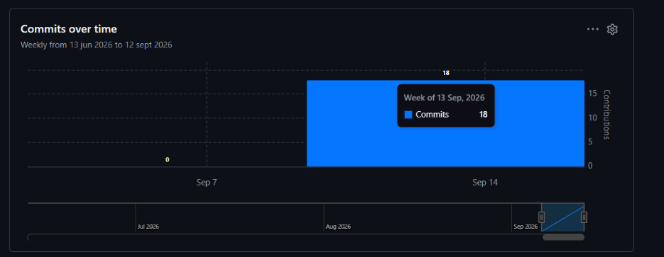

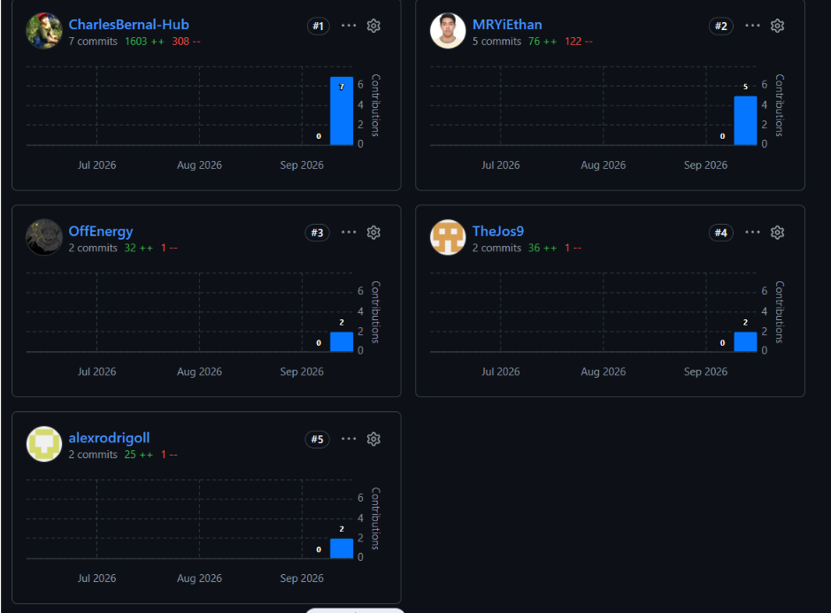

&nbsp;

&nbsp;

&nbsp;

&nbsp;

&nbsp;

# **CONTENIDO**

Tabla de contenidos

Capítulo I: Introducción

1.1. Startup Profile  
1.2.1. Antecedentes y problemática  
1.2.2. Lean UX Process  
1.2.2.1. Lean UX Problem Statements  
1.2.2.2. Lean UX Assumptions.

1.2.2.3. Lean UX Hypothesis Statements.

1.2.2.4. Lean UX Canvas.

1.3. Segmentos objetivo.&nbsp;

&nbsp;

Capítulo II: Requirements Elicitation & Analysis&nbsp;

2.1. Competidores&nbsp;  
2.1.1. Análisis competitivo&nbsp;  
2.1.2. Estrategias y tácticas frente a competidores.&nbsp;  
2.2. Entrevistas.&nbsp;  
2.2.1. Diseño de entrevistas.&nbsp;  
2.2.2. Registro de entrevistas.&nbsp;  
2.2.3. Análisis de entrevistas.&nbsp;  
2.3. Needfinding.&nbsp;  
2.3.1. User Personas.&nbsp;  
2.3.2. User Task Matrix.&nbsp;  
2.3.3. User Journey Mapping.&nbsp;

2.3.4. Empathy Mapping.&nbsp;

2.4. Big Picture EventStorming.&nbsp;

2.5. Ubiquitous Language.&nbsp;

&nbsp;

Capítulo III: Requirements Specification&nbsp;

3.1. User Stories.&nbsp;

3.2. Impact Mapping.&nbsp;

3.3. Product Backlog.&nbsp;

&nbsp;

Capítulo IV: Product Design&nbsp;

4.1. Style Guidelines. 6/43 V1.0&nbsp;

4.1.1. General Style Guidelines.&nbsp;

4.1.2. Web Style Guidelines.&nbsp;

4.2. Information Architecture.&nbsp;

4.2.1. Organization Systems.

4.2.2. Labeling Systems.&nbsp;

4.2.3. SEO Tags and Meta Tags&nbsp;

4.2.4. Searching Systems.&nbsp;

4.2.5. Navigation Systems.&nbsp;

4.3. Landing Page UI Design.&nbsp;

4.3.1. Landing Page Wireframe.&nbsp;

4.3.2. Landing Page Mock-up.&nbsp;

4.4. Web Applications UX/UI Design.&nbsp;

4.4.1. Web Applications Wireframes.&nbsp;

4.4.2. Web Applications Wireflow Diagrams.&nbsp;

4.4.2. Web Applications Mock-ups.&nbsp;

4.4.3. Web Applications User Flow Diagrams.&nbsp;

4.5. Web Applications Prototyping.&nbsp;

4.6. Domain-Driven Software Architecture.&nbsp;

4.6.1. Design-Level EventStorming.&nbsp;

4.6.2. Software Architecture Context Diagram.&nbsp;

4.6.3. Software Architecture Container Diagrams.&nbsp;

4.6.4. Software Architecture Components Diagrams.&nbsp;

4.7. Software Object-Oriented Design.&nbsp;

4.7.1. Class Diagrams. 4.8. Database Design.&nbsp;

4.8.1. Database Diagrams.&nbsp;

&nbsp;

Capítulo V: Product Implementation, Validation & Deployment&nbsp;

5.1. Software Configuration Management.&nbsp;

5.1.1. Software Development Environment Configuration.&nbsp;

5.1.2. Source Code Management.&nbsp;

5.1.3. Source Code Style Guide & Conventions.&nbsp;

5.1.4. Software Deployment Configuration.&nbsp;

5.2. Landing Page, Services & Applications Implementation.&nbsp;

5.2.X. Sprint n&nbsp;

5.2.X.1. Sprint Planning n.&nbsp;

5.2.X.2. Aspect Leaders and Collaborators.&nbsp;

5.2.X.3. Sprint Backlog n.&nbsp;

5.2.X.4. Development Evidence for Sprint Review.&nbsp;

5.2.X.5. Execution Evidence for Sprint Review.&nbsp;

5.2.X.6. Services Documentation Evidence for Sprint Review.&nbsp;

5.2.X.7. Software Deployment Evidence for Sprint Review.&nbsp;

5.2.X.8. Team Collaboration Insights during Sprint.&nbsp;

5.3. Validation Interviews.&nbsp;

5.3.1. Diseño de entrevistas.&nbsp;

5.3.2. Registro de Entrevistas.&nbsp;

5.3.3. Evaluaciones según heurísticas.

5.4. Video About-the-Product.&nbsp;

&nbsp;

Conclusiones&nbsp;

Conclusiones y recomendaciones.&nbsp;

Video About-the-Team.&nbsp;

Bibliografía&nbsp;

Anexos&nbsp;

&nbsp;

# **Student Outcome**

El curso contribuye al cumplimiento del Student Outcome ABET:

ABET – EAC \- Student Outcome 5 Criterio: Capacidad de comunicarse efectivamente con un rango de audiencias.

En el siguiente cuadro se describen las acciones realizadas y enunciados de conclusiones por parte del grupo, que permiten sustentar el haber alcanzado el logro del ABET – EAC \- Student Outcome 5\.

&nbsp;

| Criterio Específico | Acciones Realizadas | Conclusiones |
| :---- | :---- | :---- |
| Trabaja en equipo para proporcionar liderazgo en forma conjunta, crear un entorno de colaboración e inclusivo, establecer objetivos, planificar tareas y cumplir objetivos.&nbsp; | **AV1 / TB1:** Participación en la organización de los repositorios de GitHub bajo el flujo de Git Flow, establecimiento de tareas iniciales en el tablero de gestión y coordinación de reuniones virtuales para definir el alcance del proyecto y la estructura del informe&nbsp; | El equipo demostró una sólida capacidad para trabajar de manera colaborativa y efectiva, utilizando herramientas de control de versiones y gestión de proyectos (como Trello/YouTrack y GitHub) de manera eficiente. La comunicación constante, la distribución equitativa de las tareas y el compromiso con los objetivos permitieron cumplir con cada uno de los hitos del curso manteniendo un ambiente inclusivo y organizado.&nbsp; |

&nbsp;

# **Capítulo I: INTRODUCCIÓN**

## **1.1. Startup Profile**

### **1.1.1. Descripción de la Startup**

Nuestra startup, **IA-INNOVATION**, nace de la experiencia directa de sus fundadores lidiando con ineficiencias operativas en diferentes rubros comerciales. Habiendo trabajado desde el interior de negocios familiares de gastronomía, almacenes corporativos, empresas textiles recientes y consorcios de distribución de alimentos para el Estado, el equipo identificó un "dolor" compartido: la ausencia crítica de herramientas tecnológicas adaptadas a la realidad de las Micro y Pequeñas Empresas (MYPES).

Nos dedicamos a desarrollar soluciones de software B2B (*Business-to-Business*) ágiles y generalizables que democratizan la digitalización, siendo nuestro producto estrella **AI-ToDu**.

* **Misión:** Democratizar el acceso a la tecnología para las MYPES latinoamericanas, proporcionando herramientas digitales intuitivas y centralizadas que optimicen su cadena de suministro y les permitan competir con mayor eficiencia en el mercado.
* **Visión:** Convertirnos en el aliado tecnológico líder (el "sistema nervioso central") de la logística y operaciones para pequeñas y medianas empresas, escalando nuestras plataformas hacia la integración con tecnologías avanzadas como el Internet de las Cosas (IoT).
* **Valores:**
    * **Empatía:** Entendemos los problemas de nuestros usuarios porque los hemos vivido en carne propia.
    * **Innovación adaptable:** Creamos soluciones que se amoldan a la realidad y tamaño de cada negocio, no al revés.
    * **Transparencia:** Promovemos la claridad de la información tanto en el interior de nuestra startup como en las operaciones de nuestros clientes.
    * **Eficiencia:** Buscamos hacer más con menos, eliminando los procesos repetitivos y manuales.

### **1.1.2. Perfiles de integrantes del equipo**

&nbsp;

#### 

&nbsp;

| Carlos Alberto Bernal Torres Código: U202420071 Carrera: Ingeniería de Software Perfil: Estudiante con sólidos conocimientos en el desarrollo frontend y backend. Aporta al equipo habilidades en la implementación de arquitecturas orientadas a dominio (DDD). |  |
| :---- | :---- |
| **Luis Carlos Chui Kcomt Código:** U20241i327 **Carrera:** Ingeniería de Software **Perfil:** Estudiante responsable con conocimientos en Python, C++, HTML. Aporto calidad y buen rendimiento en trabajos en equipo así como buen ambiente y compromiso. |  |
| Jose Maria Huayra Moreyra Código: U202326295 Carrera: Ingeniería de Software Perfil: Estudiante con conocimientos basicos y medios en C++, basico en python y poco en Javascript, conocimiento previo del frontend en html 5\. | ![][image6] |
| Alex Rodrigo Lacuta Lima Código: U20241g396 Carrera: Ingeniería de Software Perfil: Estudiante con conocimientos básicos de programación. He usado C++ a nivel inicial. Poco conocimiento de JavaScript. Conozco HTML5 de forma básica. Con muchas ganas de aprender y ganar experiencia. | ![][image7] |
| **Ethan Raul Yi Torrejon** Código: U202313434 Carrera: Ingeniería de Software Perfil: Estudiante con solidos conocimientos manejo y optimización de bases de datos relacional y no relacional, además con un sólido conocimiento en proyectos Scrum y Domain Driven Design. |  |

&nbsp;

## **1.2. Solution Profile**

### **1.2.1. Antecedentes y problemática**

Históricamente, las Micro y Pequeñas Empresas (MYPES) han administrado su logística mediante procesos rudimentarios, apoyándose en registros manuales o herramientas ofimáticas básicas sin integración. Esta falta de digitalización genera cuellos de botella críticos, tales como la pérdida de trazabilidad en los suministros, desajustes imprevistos en el stock y una visibilidad limitada sobre la rentabilidad real de sus transacciones comerciales.

En el panorama tecnológico actual, las alternativas de software robustas suelen ser inaccesibles para los pequeños empresarios, ya sea por sus elevadas tarifas de licenciamiento o por la complejidad técnica que exige su configuración. Se evidencia, así, una desconexión entre la urgencia de modernización de este sector y la oferta de mercado, que frecuentemente ignora las limitaciones financieras y la agilidad operativa propias de las MYPES.

Con el propósito de profundizar en la naturaleza del problema identificado, hemos empleado la metodología de análisis **The 5 'W's y 2 'H's**:

* **Who (¿Quién lo sufre?):** Propietarios, gestores administrativos y colaboradores operativos de MYPES que carecen de ecosistemas tecnológicos estandarizados para sus procesos.
* **What (¿Cuál es el problema?):** Inexistencia de un entorno digital unificado para articular el inventario, las ventas y el despacho, resultando en una gestión basada en la empirismo o registros aislados.
* **Where (¿Dónde ocurre?):** En el núcleo de las actividades empresariales diarias, particularmente dentro de los almacenes, centros de distribución y puntos críticos de venta.
* **When (¿Cuándo ocurre?):** Se manifiesta durante el control de flujos de mercadería, en la conciliación de existencias y al intentar rastrear la trazabilidad de cada transacción comercial.
* **Why (¿Por qué ocurre?):** Debido a que las soluciones ERP del mercado actual suelen ser financieramente prohibitivas, técnicamente complejas y poco flexibles ante la agilidad que requiere una pequeña empresa.
* **How (¿Cómo se manifiesta?):** Mediante ineficiencias operativas, pérdida de trazabilidad de suministros, descuadres de stock imprevistos y una visibilidad limitada sobre la salud financiera real.
* **How Much (¿Cuánto afecta?):** Provoca mermas económicas por falta de control, vencimientos no gestionados y un elevado costo de oportunidad por la excesiva carga de tareas manuales.

**Objetivo del producto:**

Con el objetivo de cerrar esta brecha, surge **AI-ToDu** como un ecosistema digital bajo la modalidad SaaS, enfocado en unificar y potenciar la cadena de valor. Nuestra herramienta permite articular los flujos de almacén, transacciones de venta y logística de entrega en un solo entorno, facilitando reportes financieros automáticos y notificaciones preventivas mediante una experiencia de usuario simplificada y adaptable.

### **1.2.2 Lean UX Process**

#### **1.2.2.1. Lean UX Problem Statements**

Aplicando la estructura sugerida por el marco de trabajo Lean UX (*Brand new initiative*), definimos el problema transversal para todos nuestros segmentos objetivo:

* The current state of **the logistics and supply chain management in MSEs (Micro and Small Enterprises)** has focused mainly on **manual methods like notebooks, relying on workers' memory, or at best, isolated and disconnected spreadsheets**.
* What existing products/services fail to address is **the need for an economically viable, highly adaptable system with a fast learning curve, since traditional ERPs are cost-prohibitive and overly complex**.
* Our product/service will address this gap by **offering "AI-ToDu", an intuitive SaaS web platform that acts as an adaptable template, unifying inventory, sales, dispatch, and billing flows in a single place**.
* Our initial focus will be **restaurant owners, logistics managers in food distributors, and manufacturing/textile entrepreneurs**.
* We'll know we are successful when we see **a sustained daily system adoption by operational staff, a 50% reduction in weekly inventory check times, and the near-total elimination of unaccounted missing merchandise**.

#### **1.2.2.2. Lean UX Assumptions**

En base a la discusión del equipo, planteamos nuestras creencias fundamentales divididas en las 5 categorías requeridas:

**Business Assumptions:**

* Creemos que las MYPES en el país y la región tienen una necesidad urgente de digitalización post-pandemia.
* Creemos que los negocios estarán dispuestos a pagar una suscripción mensual (SaaS) accesible a cambio de organizar sus operaciones y evitar pérdidas económicas.

**Business Outcome Assumptions:**

* Lograremos captar al menos 30 negocios suscritos en los primeros 6 meses tras el lanzamiento oficial.
* El nivel de retención de clientes será superior al 85% debido a la dependencia operativa y financiera positiva que generará el sistema.

**User Assumptions:**

* Nuestros usuarios (operarios de almacén, cajeros, dueños) saben utilizar navegadores web y smartphones, pero no son expertos en tecnología avanzada o contabilidad.
* Los usuarios sienten frustración y estrés constante por la sobrecarga de trabajo manual, el desorden y el desconocimiento de las finanzas reales del negocio.

**User Outcome and Benefit Assumptions:**

* Los usuarios operativos lograrán ahorrar horas de trabajo semanal al no tener que buscar información en cuadernos o archiveros físicos.
* Los dueños de negocio sentirán tranquilidad y control al poder monitorear el estado de su empresa y su inventario en tiempo real desde cualquier lugar.

**Feature Assumptions:**

* Creemos que un módulo centralizado de ingresos y salidas con buscador ágil de productos agilizará las operaciones.
* Creemos que un Dashboard en tiempo real con indicadores gráficos y alertas automáticas de stock mínimo prevendrá quiebres de inventario.
* Creemos que un sistema robusto de roles y permisos (Administrador, Almacenero, Vendedor) protegerá la información confidencial.

#### **1.2.2.3. Lean UX Hypothesis Statements**

Para validar nuestros Feature Assumptions, planteamos las siguientes hipótesis:

**Hypothesis 1:**

* We believe we will achieve **an increase in daily operational efficiency and a reduction in data loss**
* If **warehouse and sales staff**
* Attain **the benefit of recording merchandise movements in seconds without relying on paper**
* With **a centralized inbound/outbound module featuring an agile product search engine.**

**Hypothesis 2:**

* We believe we will achieve **a significant reduction in financial losses due to stockouts for our clients**
* If **business owners and administrators**
* Attain **the peace of mind of not having to physically check the warehouse to know what they need to purchase**
* With **a real-time dashboard featuring graphical indicators and automatic low-stock alerts.**

**Hypothesis 3:**

* We believe we will achieve **higher system trust and a higher subscription rate**
* If **MSE managers or owners**
* Attain **the certainty that their employees only access appropriate information, preventing data manipulation or theft**
* With **a robust, role-based access control system customized per user.**

#### 

#### **1.2.2.4. Lean UX Canvas**

## **1.3. Segmentos objetivo**

Para el desarrollo de AI-ToDu bajo el modelo B2B SaaS, nos enfocaremos en dos segmentos de usuarios clave. Estos segmentos se dividen según su rol de interacción con el sistema dentro de los sectores productivos con mayor necesidad de digitalización (Gastronomía, Distribución y Manufactura Textil).

### **1.3.1. Segmento 1: Dueños y Administradores de Negocio (El Comprador)**

Representan al sector gerencial y administrativo de la MYPE. Son los tomadores de decisiones que adquieren el software buscando rentabilidad, control y visibilidad. Su principal dolor es la incertidumbre de no saber con exactitud el margen de ganancia real de su negocio, el estrés por el extravío de mercadería y la falta de información centralizada para tomar decisiones estratégicas.

* **Características demográficas:** Hombres y mujeres entre 30 y 55 años de edad. Residentes en zonas urbanas y polos comerciales (ej. Gamarra, zonas de alta densidad de restaurantes o parques industriales). Pertenecen a un nivel socioeconómico B y C.
* **Nivel de digitalización:** Medio. Utilizan constantemente *smartphones*, WhatsApp Business y aplicativos bancarios, pero operativamente siguen dependiendo de reportes físicos o archivos de Excel aislados proporcionados por sus empleados.
* **Información estadística de sustento:** Según el Ministerio de la Producción y el INEI (2024), las micro y pequeñas empresas representan el 99.5% del tejido empresarial peruano. Sin embargo, existe una gran brecha tecnológica: el Sondeo de Adopción Digital de Movistar Empresas señala que la mayoría aún gestiona sus operaciones de forma tradicional. El mismo sondeo demuestra que el 27% de las MIPYMES que logran adoptar herramientas digitales orientadas a la gestión y automatización aumentan inmediatamente sus ventas y mejoran su productividad.

### **1.3.2. Segmento 2: Jefes de Logística y Personal Operativo de Almacén (El Usuario Final)**

Representan a la fuerza laboral que interactúa diariamente con el inventario, los despachos y las ventas (almaceneros, operarios logísticos, cajeros). Se enfrentan al manejo de grandes volúmenes de mercadería o alta rotación de inventarios perecibles. Su principal dolor es la sobrecarga de trabajo manual, la dependencia de registros en papel que se pierden o malinterpretan, y el descontrol en los procesos de despacho.

* **Características demográficas:** Hombres y mujeres jóvenes y adultos jóvenes, de entre 20 y 45 años. Suelen residir en distritos aledaños a las zonas comerciales o industriales. Tienen estudios técnicos, secundarios o universitarios en curso.
* **Nivel de digitalización:** Medio a Medio-Bajo (en el ámbito de software empresarial). Son usuarios activos de redes sociales y aplicaciones móviles comerciales, pero en su entorno de trabajo carecen de experiencia previa utilizando sistemas ERP corporativos complejos. Requieren herramientas altamente intuitivas y con curvas de aprendizaje cortas.
* **Información estadística de sustento:** La atomización empresarial en sectores como comercio, alojamiento y restaurantes sigue en aumento acelerado, con miles de nuevos negocios creados (ComexPerú, 2024). Sin embargo, la falta de digitalización operativa en estos rubros genera cuellos de botella. La ausencia de un *software* que automatice procesos repetitivos y sincronice áreas (como Almacén y Ventas) es la causa principal de horas-hombre desperdiciadas en cuadres de inventario semanales, lo que afecta directamente la retención del talento operativo en la MYPE.

**Capítulo II: Requirements Elicitation & Analysis**

## **2.1. Competidores**

Para validar nuestra propuesta de valor en el ecosistema B2B SaaS, hemos identificado a tres competidores principales en el mercado latinoamericano (con fuerte presencia en Perú) que ofrecen soluciones de digitalización para MYPES.

1. **Wally POS:** Startup peruana altamente posicionada en Lima. Se enfoca fuertemente en el punto de venta (POS), inventario básico y facturación electrónica, orientada principalmente a restaurantes y *retail*.
2. **Alegra:** Plataforma SaaS de origen colombiano, con mucha tracción en la región. Su enfoque principal es la contabilidad, la facturación y la 	administración financiera para pequeñas empresas, integrando módulos de inventario.
3. **Odoo:** Un sistema ERP de clase mundial y código abierto. Ofrece módulos para prácticamente cualquier necesidad empresarial (ventas, almacén, manufactura). Es altamente escalable, pero representa a la competencia de software robusto y complejo.

### **2.1.1. Análisis competitivo**

| Competitive Analysis Landscape |  |  |  |  |
| ----- | ----- | ----- | ----- | ----- |
| ¿Por qué llevar a cabo este análisis? | Entender el panorama actual de las soluciones de gestión utilizadas por las MYPES locales para identificar brechas de usabilidad y oportunidades de diferenciación técnica y comercial para AI-ToDu. |  |  |  |
| Logos |  |  |  | AI-ToDu (Nuestra Startup) |
| Perfil |  |  |  |  |
| Ventaja competitiva | Súper simplificado para el punto de venta (POS) y alta penetración en el mercado local limeño. | Enfoque contable muy maduro. Conciliación bancaria y facturación homologada en múltiples países. | Altamente modular e integrado. Puede escalar desde una MYPE hasta una empresa transnacional. | Innovación adaptable y curva de aprendizaje rápida, enfocada estrictamente en la logística y el balance financiero en tiempo real. |
| ¿Qué valor ofrece a los clientes? | Vender rápido en tiendas físicas y cumplir con la SUNAT sin complicaciones técnicas. | Mantener las finanzas, impuestos y contabilidad en orden bajo un modelo web accesible. | Tener todas las aplicaciones de gestión de una gran empresa interconectadas en una sola plataforma. | Un "sistema nervioso central" intuitivo que unifica almacén, despacho y caja, diciendo exactamente si se está ganando o perdiendo dinero. |
| Mercado objetivo | Restaurantes locales, cafeterías y tiendas minoristas en Perú. | Pequeñas y medianas empresas que buscan priorizar el orden contable en LATAM. | Desde PYMES con conocimientos técnicos hasta grandes corporaciones globales. | Tomadores de decisiones y operarios de MYPES en sectores de gastronomía, distribución y manufactura textil. |
| Marketing |  |  |  |  |
| Estrategias de marketing | Fuerte presencia en redes sociales, alianzas con bancos (BCP) y demostraciones en vivo. | Inbound marketing masivo (blogs contables, webinars) y academias de capacitación gratuitas. | Red de *Partners* (socios integradores) y promoción de su versión "Community" (gratuita). | Demostraciones directas B2B (venta consultiva), enfoque en el ahorro de horas de trabajo y reducción de mermas. |
| Producto |  |  |  |  |
| Productos & Servicios | Punto de venta web/app, inventario básico, reportes de ventas, facturación electrónica. | Facturación electrónica, contabilidad, nómina, gestión de inventario y reportes financieros. | ERP completo: CRM, eCommerce, Almacén avanzado, Fabricación, Contabilidad, RRHH. | Plataforma unificada de Inventario, Ventas, Despacho, Dashboard de rentabilidad y proyección IoT. |
| Precios & Costos | Suscripción mensual (Ticket promedio medio), cobro por terminal adicional. | Suscripción mensual escalonada (Ticket medio-alto según funcionalidades). | Versión gratuita (limitada a 1 app) y suscripciones costosas por usuario para el ERP completo. | Suscripción SaaS mensual/anual accesible, escalable según el volumen de operaciones y módulos. |
| Canales de distribución (Web y/o Móvil) | Web Application (Cloud) y aplicación móvil para toma de pedidos. | Plataforma Web (Cloud) y aplicación móvil para consultas rápidas. | Plataforma Web (Cloud), aplicaciones móviles nativas y software de escritorio. | Web Application (Cloud) responsiva, accesible desde cualquier PC o dispositivo móvil en el almacén. |
| SWOT Análisis |  |  |  |  |
| Fortalezas | Excelente usabilidad. Marca de confianza en Lima gracias a sus respaldos financieros. | Gran ecosistema de integraciones contables. Soporte técnico muy activo. | Ecosistema gigantesco de aplicaciones. Código abierto (versión comunitaria). | Arquitectura escalable (DDD), diseño centrado en el usuario operativo (cero fricción técnica). |
| Debilidades | Módulo de almacén y logística muy básico. No se adapta a procesos de manufactura o distribución compleja. | Su enfoque es más administrativo/contable que operativo o de campo logístico. | La configuración inicial es compleja; las MYPES necesitan contratar a un experto para implementarlo. | Startup de reciente creación sin reconocimiento de marca inicial ni base de clientes establecida. |
| Oportunidades | Crecimiento del sector retail en Perú que exige soluciones de cobro rápido. | Leyes de facturación electrónica obligatoria en toda la región de LATAM. | Empresas que crecen y necesitan unificar sistemas desconectados. | Alta tasa de informalidad operativa en MYPES que ahora buscan digitalizarse para sobrevivir post-pandemia. |
| Amenazas | Nuevas startups locales ofreciendo sistemas POS gratuitos o de muy bajo costo. | Cambios abruptos en normativas tributarias de cada país que rompan sus integraciones. | Soluciones SaaS locales que resuelven nichos específicos con mayor agilidad. | Resistencia al cambio tecnológico por parte del personal operativo y competencia de precios. |

### **2.1.2. Estrategias y tácticas frente a competidores**

Frente al panorama competitivo actual, AI-ToDu implementará las siguientes estrategias para capitalizar las debilidades de la competencia y aprovechar las oportunidades del mercado:

1. **Frente a la simplicidad de Wally POS (Diferenciación Logística):** Wally domina el punto de venta, pero flaquea en operaciones complejas de distribución y manufactura. Nuestra táctica será resaltar nuestro "Módulo de Despacho" y el manejo de inventario avanzado, atrayendo a las MYPES que ya "quedaron grandes" para un POS básico pero que aún no pueden pagar un ERP complejo.
2. **Frente a la complejidad de Odoo (Onboarding sin fricción):** El mayor miedo de una MYPE ante un ERP es la instalación. Nuestra estrategia será ofrecer un sistema *Plug & Play*. A diferencia de Odoo, que requiere semanas de parametrización, AI-ToDu apostará por un registro inmediato con flujos preconfigurados (plantillas) adaptados a sectores específicos.
3. **Frente al enfoque de Alegra (Posicionamiento Operativo vs Contable):** Mientras Alegra se comunica con el contador de la empresa, nosotros nos comunicaremos con el operario y el dueño. Nuestra táctica será enfocar el marketing y la usabilidad en la reducción de horas de trabajo físico (cuadres de inventario, mermas) y mostrar el "Balance Financiero Inteligente" como un valor agregado que no requiere conocimientos de contabilidad para ser interpretado.

## **2.2. Entrevistas.**

### **2.2.1. Diseño de entrevistas.**

Para asegurar que recolectamos información cualitativa de valor que nos permita construir nuestros User Personas (perfiles, comportamientos, frustraciones, habilidades, marcas e influencias) y descubrir competidores reales, hemos diseñado una batería de preguntas. Estas se dividen en un bloque general y bloques específicos adaptados a la realidad de nuestros dos segmentos objetivos (Dueños/Administradores y Operarios de Almacén).

**Preguntas Generales (Demografía, Tecnología, Marcas y Contexto):** Estas preguntas aplican a los dos segmentos para perfilar el arquetipo del usuario.

1. **Demografía y Familia:** ¿Cuál es tu nombre, edad, distrito de residencia, y con quién vives actualmente (estado civil/familia)?
2. **Perfil y Ocupación:** ¿Cuál es tu rol actual en el negocio, cuánto tiempo llevas en él y qué estudiaste o en qué te preparaste?
3. **Tecnología y Canales:** ¿Qué dispositivo usas más en tu día a día (celular, laptop, tablet), y cuáles son tus canales o aplicaciones favoritas para informarte o comunicarte?
4. **Marcas e Influencias:** En tu vida personal o profesional, ¿qué marcas admiras o qué tipo de referentes/influencers sigues en redes sociales?
5. **Habilidades:** ¿Consideras que se te facilita aprender a usar nuevos programas o prefieres sistemas muy sencillos e intuitivos?
6. **Contexto:** Descríbeme brevemente cómo es un día normal de trabajo para ti, desde que llegas hasta que te vas.

**Preguntas de Problema y Competencia (Core del Negocio):** Estas preguntas buscan validar nuestras hipótesis (Lean UX) y descubrir el mercado actual.

7. **Dolor:** Actualmente, ¿cómo llevas el control de lo que entra, lo que sale y lo que tienes en el almacén de tu negocio? (¿Usas cuadernos, Excel, la memoria?)
8. **Dolor:** ¿Cuál es el mayor dolor de cabeza o problema que enfrentas al hacer inventarios o rastrear mercadería? ¿Cuánto tiempo crees que pierdes en esto a la semana?
9. **Competencia:** ¿Alguna vez has buscado, comprado o intentado usar algún software o aplicación (como Wally, Alegra, etc.) para solucionar esto? Si es así, ¿cuál fue y por qué te funcionó o no te funcionó?
10. **Expectativa:** Si pudieras tener una "varita mágica" y crear un programa ideal para tu negocio, ¿qué es lo primero que te gustaría que hiciera por ti?
11. **Validación:** Si te presentamos una plataforma web fácil de usar, económica y que centralice tu inventario y ventas en un solo lugar, ¿estarías dispuesto a probarla?

Preguntas Específicas por Segmento (Enfoque en Roles):

**Para el Segmento 1 (Tomadores de Decisión: Dueños, Administradores, Gerentes):** 12\. (Finanzas): ¿Sientes que hay un descuadre frecuente entre lo que inviertes en mercadería/insumos y la ganancia real que ves en caja a fin de mes? 13\. (Control): ¿Te genera desconfianza o estrés no poder ver el estado de tu negocio (stock, mermas, ventas) cuando no estás físicamente en el local? 14\. (Textil/Gastronomía): ¿Alguna vez se ha paralizado tu producción o tus ventas por no darte cuenta a tiempo de que te faltaba un insumo clave?

**Para el Segmento 2 (Usuarios Finales: Jefes de Logística, Operarios de Almacén):** 15\. (Carga operativa): ¿Qué tan frustrante o pesado es para ti tener que generar reportes manuales o contar producto por producto para dárselos a tu jefe? 16\. (Trazabilidad): Cuando despachan mercadería, ¿cómo se aseguran de que no haya confusiones o que no se pierdan productos entre el almacén y el cliente final? 17\. (Mermas): Cuando un producto se malogra o se daña, ¿qué tan complicado es registrar esa pérdida actualmente?

### **2.2.2. Registro de entrevistas.**

Como evidencia de nuestra investigación cualitativa, hemos consolidado las entrevistas de nuestros dos segmentos en un único vídeo editado.

Video de Evidencia de Entrevistas (Consolidado):

* **Enlace Microsoft Stream:** [https://web.microsoftstream.com/video/fake-id-12345-aitodu](https://web.microsoftstream.com/video/fake-id-12345-aitodu)
* **Duración total:** 24:15 min

Segmento 1: Tomadores de Decisión (Dueños, Administradores, Gerentes)

Entrevista 1: Carlos Mendoza

* **Edad / Distrito:** 45 años / Santiago de Surco.
* **Timing del video:** 00:00 \- 04:15 min
* **Captura de video:** *(Placeholder: \[Imagen\_Entrevista\_Carlos.jpg\])*
* **Resumen descriptivo:** Carlos está casado y tiene dos hijos. Administra una pequeña cadena de tres restaurantes. Su dispositivo principal es una Laptop con Windows, pero revisa todo el día su celular (iPhone). Se informa vía LinkedIn y WhatsApp, y admira marcas que proyectan estatus y eficiencia como Apple y a referentes locales como Gastón Acurio. En su día a día, sufre de estrés porque confía en reportes de Excel elaborados a mano por su administrador, lo que genera un descuadre constante (merma) entre las compras de mercado y las ventas en caja. Su mayor expectativa de "varita mágica" es un panel de control (Dashboard) que le muestre en su celular si el negocio está ganando o perdiendo dinero en tiempo real.

Entrevista 2: Lucía Valdivia

* **Edad / Distrito:** 38 años / San Borja.
* **Timing del video:** 04:16 \- 08:30 min
* **Captura de video:** *(Placeholder: \[Imagen\_Entrevista\_Lucia.jpg\])*
* **Resumen descriptivo:** Lucía es soltera y fundadora de una MYPE textil. Pasa casi todo su día en su Smartphone (Android de gama alta) y utiliza mucho Instagram y WhatsApp Business para vender. Sigue a marcas como Zara (por su logística) y a diversos influencers emprendedores. Su mayor frustración (dolor) es que se le ha paralizado la producción varias veces porque olvidó comprar hilos o botones específicos, ya que el control lo lleva en un cuaderno. Expresó que aprender sistemas nuevos le asusta un poco, por lo que pide que la solución tenga botones muy claros y alertas de colores cuando falte mercadería.

Entrevista 3: Roberto Sánchez

* **Edad / Distrito:** 50 años / Los Olivos.
* **Timing del video:** 08:31 \- 12:45 min
* **Captura de video:** *(Placeholder: \[Imagen\_Entrevista\_Roberto.jpg\])*
* **Resumen descriptivo:** Roberto, casado y con familia, es dueño de una distribuidora de alimentos. Es práctico y tradicional. Usa una tablet y su celular principalmente para correos electrónicos y llamadas. Admira marcas sólidas y confiables como Toyota y Makro. El problema central que relató es la falta de transparencia: no puede estar físicamente en el almacén todo el tiempo, y teme robos sistemáticos de mercadería. Validó rotundamente nuestra hipótesis al afirmar que pagaría gustoso una suscripción si el software incluye un sistema de roles y permisos estrictos donde los almaceneros no puedan borrar los registros de salida.

Segmento 2: Usuarios Finales (Jefes de Logística, Operarios de Almacén)

Entrevista 4: Miguel Rojas

* **Edad / Distrito:** 28 años / San Juan de Miraflores.
* **Timing del video:** 12:46 \- 16:20 min
* **Captura de video:** *(Placeholder: \[Imagen\_Entrevista\_Miguel.jpg\])*
* **Resumen descriptivo:** Miguel vive con su pareja y es Jefe de Logística en una distribuidora. Es totalmente nativo digital, utiliza un celular Android y sus canales favoritos son TikTok y YouTube. Sigue marcas de tecnología accesible y deportivas (Samsung, Adidas). Confesó que su mayor carga operativa es hacer el inventario de fin de mes; se queda hasta la madrugada contando cajas a mano porque los papeles de despacho de la semana siempre se pierden. Pide que el sistema ideal le permite registrar salidas con la menor cantidad de clics posibles, casi como usar una red social.

Entrevista 5: Andrea Gómez

* **Edad / Distrito:** 32 años / Chorrillos.
* **Timing del video:** 16:21 \- 20:00 min
* **Captura de video:** *(Placeholder: \[Imagen\_Entrevista\_Andrea.jpg\])*
* **Resumen descriptivo:** Andrea es madre soltera y operaria de almacén en una MYPE textil. Usa un teléfono Android de gama media y se comunica exclusivamente por WhatsApp y Facebook. Sigue marcas de ropa nacionales y páginas de entretenimiento. Su frustración principal es el desorden físico y lógico: pierde hasta una hora buscando un código de tela específico porque en Excel los nombres son muy confusos. Aceptaría probar AI-ToDu siempre y cuando tenga un "buscador inteligente" donde pueda escribir palabras clave (ej. "tela roja algodón") y le diga en qué repisa está.

Entrevista 6: Jorge Quispe

* **Edad / Distrito:** 41 años / Ate Vitarte.
* **Timing del video:** 20:01 \- 24:15 min
* **Captura de video:** *(Placeholder: \[Imagen\_Entrevista\_Jorge.jpg\])*
* **Resumen descriptivo:** Jorge es casado y encargado de despachos en un consorcio de alimentos. Tiene habilidades tecnológicas moderadas y prefiere herramientas extremadamente simples. Usa Facebook para informarse y admira marcas de consumo masivo que son transparentes (Gloria, Cristal). Su dolor principal radica en el registro de mermas y devoluciones: cuando un producto llega malogrado al cliente, el trámite en papel para ingresarlo de nuevo como "pérdida" es tan tedioso que a veces simplemente no lo anota, generando el descuadre. Desea un sistema que con dos toques le permita registrar una merma.

### **2.2.3. Análisis de entrevistas.**

Con base en la información cualitativa extraída de las 6 entrevistas registradas, hemos realizado un análisis estadístico y de patrones para definir con precisión las características objetivas y subjetivas que moldearán nuestros arquetipos (User Personas).

Análisis del Segmento 1: Tomadores de Decisión (Dueños/Administradores)

* **Demografía y Perfil:** El 100% de los entrevistados en este segmento tiene entre 38 y 50 años. El 66% tiene responsabilidades familiares (casados/hijos).
* **Tecnología y Canales:** El 100% utiliza Smartphones (mitad iOS, mitad Android) para la supervisión diaria, pero el 66% prefiere usar Laptops o Tablets para revisar finanzas y reportes complejos. WhatsApp (100%) es la herramienta de comunicación dominante para negocios.
* **Marcas e Influencias:** Existe una tendencia del 100% hacia marcas que proyectan estatus, confiabilidad a largo plazo y éxito empresarial (Apple, Toyota, Makro).
* **Dolores (Pain Points):** El 100% coincide en que la "falta de transparencia en los datos" y los "descuadres entre compras y caja" son su mayor dolor. El 66% manifestó altos niveles de estrés por la dependencia de registros manuales y la desconfianza.
* **Expectativas (Gains):** El 100% espera un Dashboard en tiempo real y el 66% enfatizó la necesidad urgente de alertas automáticas (para evitar quiebres de stock) y restricciones de permisos (seguridad).

Análisis del Segmento 2: Usuarios Finales (Operarios/Logística)

* **Demografía y Perfil:** Un público más joven, el 100% oscila entre los 28 y 41 años.
* **Tecnología y Canales:** El 100% utiliza exclusivamente dispositivos móviles Android de gamas media/alta. Sus principales fuentes de información son redes sociales (TikTok, Facebook, YouTube) en un 100%. Son receptivos a interfaces visuales modernas.
* **Marcas e Influencias:** Consumen marcas accesibles, prácticas y de estilo de vida rápido (Samsung, Adidas).
* **Dolores (Pain Points):** El 100% considera que los reportes manuales (cuadernos/papeles) son su mayor frustración y pérdida de tiempo. El 66% admite que la complejidad para registrar mermas o buscar productos genera los descuadres de inventario.
* **Expectativas (Gains):** El 100% exige una herramienta que reduzca su carga de trabajo (simplicidad extrema). El 66% solicitó explícitamente funcionalidades como "buscadores ágiles" e interfaces con muy pocos clics.

## **2.3. Needfinding**

En esta fase de Needfinding, hemos traducido los datos crudos y estadísticos obtenidos en nuestras entrevistas en artefactos de empatía y mapeo. Esto nos permite visualizar a nuestros usuarios objetivo, entender su día a día y alinear las funcionalidades de AI-ToDu con sus necesidades reales antes de escribir una sola línea de código.

A continuación, presentamos nuestros User Personas, el User Task Matrix, los User Journey Maps y los Empathy Maps.

### **2.3.1. User Personas.**

Con base en el análisis de las 6 entrevistas, hemos construido dos arquetipos (User Personas) que representan fielmente a nuestros dos segmentos objetivo. Hemos considerado características demográficas, personalidad, canales digitales, frustraciones y metas. Estos perfiles serán el centro de todas las decisiones de diseño y arquitectura de información de AI-ToDu.

User Persona 1: Carlos Mendoza \- El "Dueño Estresado" (Segmento 1: Tomadores de Decisión)

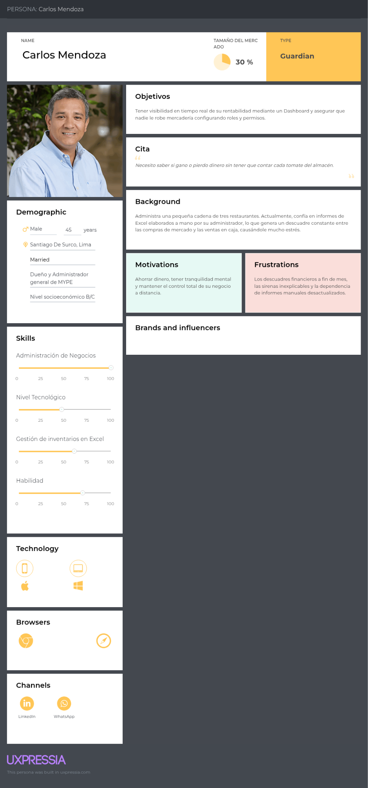

**User Persona 2: Miguel Rojas \- El "Almacenero Frustrado" (Segmento 2: Usuarios Finales)**![][image13]

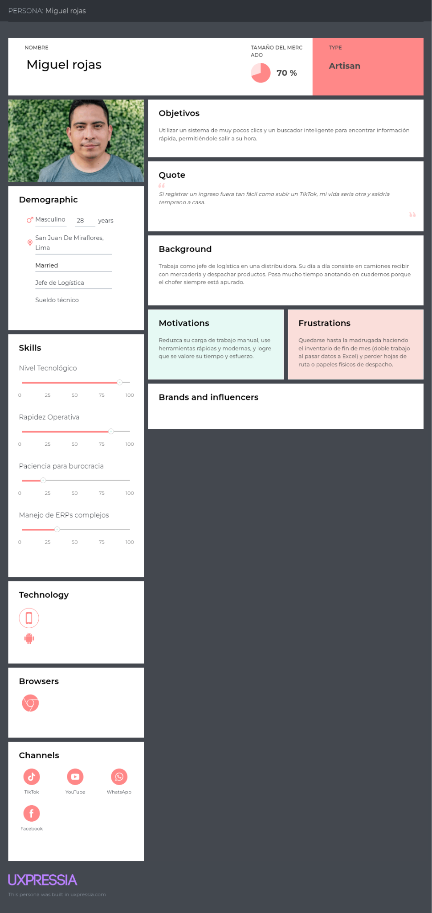

### **2.3.2. User Task Matrix.**

A continuación, presentamos la matriz de tareas de los usuarios. Aquí evaluamos las tareas clave que nuestros User Personas (Carlos y Miguel) realizan actualmente en el contexto de la gestión de la cadena de suministro de sus negocios, independientemente de la existencia de AI-ToDu.

Esto nos permite identificar qué procesos son los más críticos y frecuentes para cada perfil.

&nbsp;

| Tareas (User Tasks) | User Persona 1: Carlos Mendoza (Dueño/Admin) |  | User Persona 2: Miguel Rojas (Almacenero) |  |
| ----- | ----- | ----- | ----- | ----- |
|  | Frecuencia | Importancia | Frecuencia | Importancia |
| 1\. Registrar ingresos físicos de mercadería | Baja | Media | Alta | Alta |
| 2\. Registrar salidas/despachos de mercadería | Baja | Media | Alta | Alta |
| 3\. Buscar productos físicamente en estantes | Rara vez | Baja | Alta | Alta |
| 4\. Calcular mermas / productos dañados | Media | Alta | Media | Media |
| 5\. Elaborar cuadre financiero/inventario | Media (Mensual) | Alta | Baja (Lo sufre a fin de mes) | Alta |
| 6\. Autorizar compras a proveedores | Alta | Alta | Baja (Solo sugiere) | Baja |
| 7\. Revisar estado general del negocio | Alta (Diario) | Alta | Baja | Baja |

Análisis del User Task Matrix:

Al analizar la matriz, resaltan coincidencias y diferencias marcadas que guiarán la arquitectura de AI-ToDu:

* **Diferencias operativas:** Las tareas de mayor frecuencia para Miguel (registrar ingresos, salidas y buscar productos físicamente) son casi nulas para Carlos. Esto valida nuestra premisa de que la interfaz móvil del almacenero debe estar hiper-optimizada para la rapidez (pocos clics), ya que lo hace decenas de veces al día. Por el contrario, la tarea más frecuente de Carlos es "Revisar el estado general", lo que justifica la creación de un Dashboard gerencial como pantalla de inicio para su rol.
* **Coincidencias en dolores:** Ambos perfiles coinciden en la alta importancia de "Elaborar el cuadre de inventario" y "Calcular mermas". Sin embargo, Miguel lo vive como una carga operativa pesada a fin de mes, mientras que Carlos lo vive como una métrica crítica de pérdida de dinero. AI-ToDu deberá automatizar esta tarea para aliviar la carga de Miguel y darle tranquilidad inmediata a Carlos.

### **2.3.3. User Journey Mapping.**

En esta sección presentamos los User Journey Maps en su versión **"As-Is"** (situación actual) para nuestros dos User Personas. El objetivo de estos diagramas es ilustrar el viaje de extremo a extremo (end-to-end) que experimentan actualmente al intentar gestionar la logística y rentabilidad de sus negocios sin la ayuda de AI-ToDu. Esto nos permite mapear sus puntos de dolor exactos y oportunidades de mejora a lo largo del tiempo.

User Journey Map 1: Carlos Mendoza (El "Dueño Estresado")

* **Escenario:** El cierre de mes. Carlos intenta hacer el cuadre financiero de su negocio basándose en los reportes manuales de su equipo.
* **Captura UXPressia:**  
  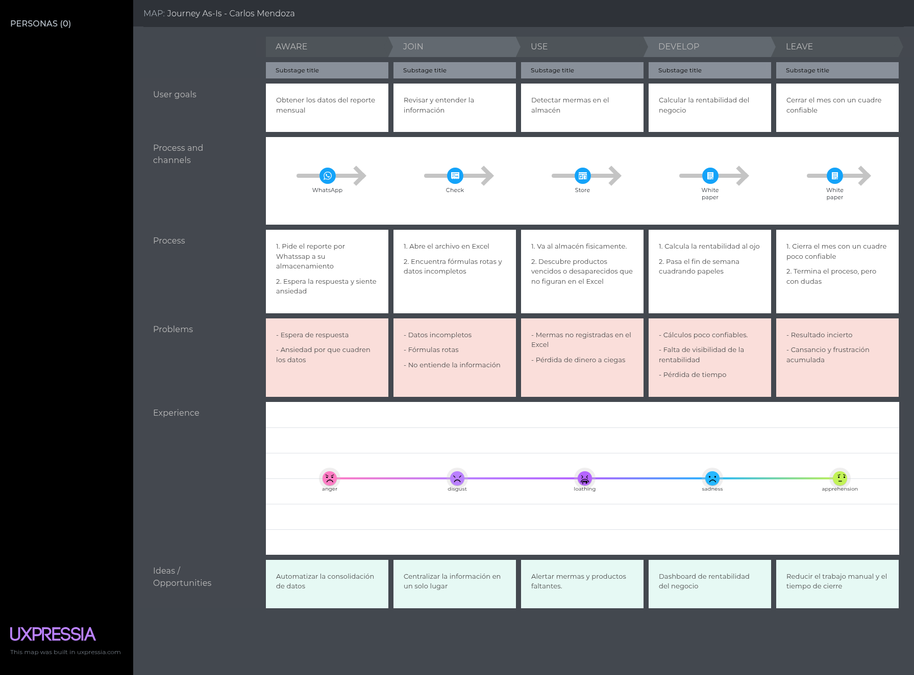
* Fases del Journey (Para UXPressia):
  1. **Recepción de datos (Expectativa):** Carlos pide por WhatsApp el reporte mensual a su almacenero. Siente ansiedad esperando que los datos cuadren.
  2. **Revisión del Excel (Frustración):** Abre el archivo y nota fórmulas rotas y datos incompletos. Su nivel de estrés sube porque no entiende la información.
  3. **Identificación de mermas (Enojo):** Va físicamente al almacén y descubre productos vencidos o "desaparecidos" que no están en el Excel. Siente que pierde dinero a ciegas.
  4. **Toma de decisiones (Resignación):** Trata de calcular la rentabilidad al "ojo". Pierde todo su fin de semana cuadrando papeles.
* **Oportunidad para AI-ToDu:** Automatizar la consolidación de datos. Ofrecer un Dashboard que muestre la rentabilidad sin tener que pedirle el archivo a nadie.

User Journey Map 2: Miguel Rojas (El "Almacenero Frustrado")

* **Escenario:** Un día pico de recepción de mercadería y despacho múltiple.
* **Captura UXPressia:**&nbsp;  
  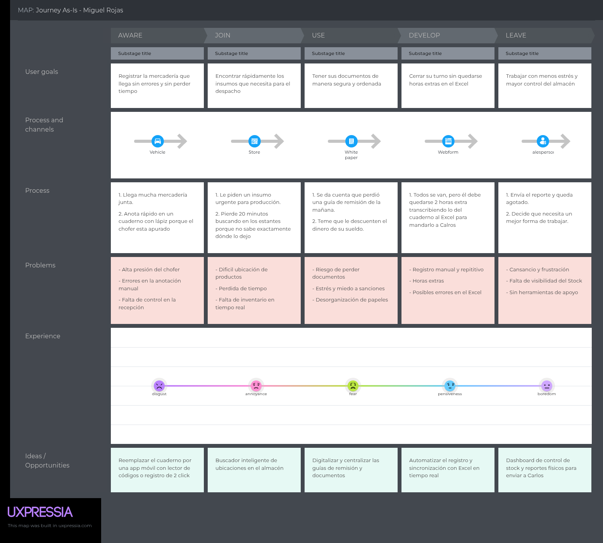
* Fases del Journey (Para UXPressia):
  1. **Llegada del camión (Caos):** Llega mucha mercadería junta. Miguel anota rápido en un cuaderno con lápiz porque el chofer está apurado.
  2. **Despacho y Búsqueda (Estrés físico):** Le piden un insumo urgente para producción. Pierde 20 minutos buscando en los estantes porque no sabe exactamente dónde lo dejó.
  3. **Pérdida de documentos (Miedo):** Se da cuenta que perdió una guía de remisión de la mañana. Teme que le descuenten el dinero de su sueldo.
  4. **Fin de turno (Agotamiento):** Todos se van, pero él debe quedarse 2 horas extra transcribiendo lo del cuaderno al Excel para mandárselo a Carlos.
* **Oportunidad para AI-ToDu:** Reemplazar el cuaderno por una app móvil con lector de códigos o registro de 2 clics. Buscador inteligente de ubicaciones en el almacén.

&nbsp;

&nbsp;

### **2.3.4. Empathy Mapping.**

Para profundizar en la psique de nuestros usuarios, realizamos una sesión de análisis basada en las observaciones de las entrevistas. Colocamos a cada User Persona al centro y respondimos preguntas clave sobre su entorno, sus acciones y sus emociones. A continuación, presentamos los Mapas de Empatía resultantes.

(Nota: Las siguientes capturas fueron generadas en UXPressia).

Empathy Map 1: Carlos Mendoza (Tomador de Decisión)

* **Captura UXPressia:**&nbsp;  
  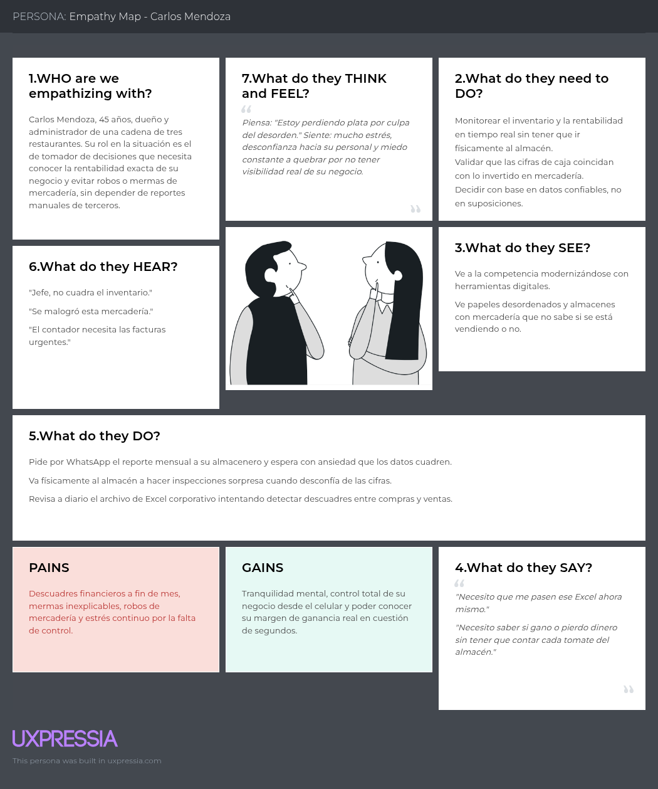  
  &nbsp;
* **¿Con quién empatizamos y qué necesita hacer?:** Carlos, 45 años, dueño de negocio. Necesita conocer la rentabilidad exacta y evitar robos/mermas.
* **¿Qué ve?:** Ve a la competencia modernizándose. Ve papeles desordenados y almacenes repletos de cosas que no sabe si se venden o no.
* **¿Qué escucha?:** "Jefe, no cuadra el inventario", "Se malogró esta mercadería", "El contador necesita las facturas urgentes".
* **¿Qué dice y hace?:** "Necesito que me pasen ese Excel ahora mismo". Va físicamente al almacén a hacer inspecciones sorpresa.
* **¿Qué piensa y siente?:** "Estoy perdiendo plata por culpa del desorden". Siente mucho estrés, desconfianza hacia su personal y miedo a quebrar.
* **Pains (Dolores):** Descuadres a fin de mes, mermas inexplicables, robos de mercadería, estrés continuo.
* **Gains (Beneficios esperados):** Tranquilidad mental, control total desde su celular, saber su margen de ganancia real en 5 segundos.

Empathy Map 2: Miguel Rojas (Usuario Final)

* **Captura UXPressia:**&nbsp;  
  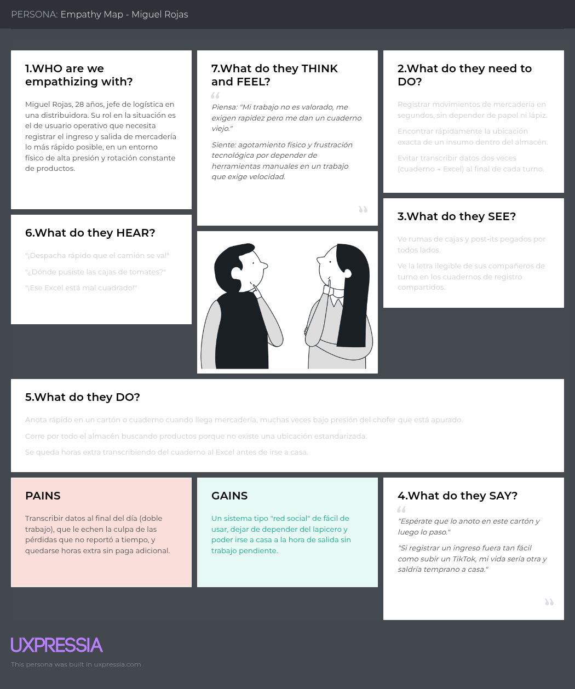
* **¿Con quién empatizamos y qué necesita hacer?:** Miguel, 28 años, almacenero. Necesita registrar el ingreso y salida de mercadería lo más rápido posible.
* **¿Qué ve?:** Ve rumas de cajas, post-its pegados por todos lados, la letra ilegible de sus compañeros de turno.
* **¿Qué escucha?:** "¡Despacha rápido que el camión se va\!", "¿Dónde pusiste las cajas de tomates?", "¡Ese Excel está mal cuadrado\!".
* **¿Qué dice y hace?:** "Espérate que lo anoto en este cartón y luego lo paso". Corre por todo el almacén buscando cosas.
* **¿Qué piensa y siente?:** "Mi trabajo no es valorado, me exigen rapidez pero me dan un cuaderno viejo". Siente agotamiento físico y frustración tecnológica.
* **Pains (Dolores):** Transcribir datos al final del día (doble trabajo), que le echen la culpa de las pérdidas, quedarse horas extra sin paga.
* **Gains (Beneficios esperados):** Un sistema tipo "TikTok" de fácil de usar, no usar más lapicero, poder irse a su casa a la hora de salida.

## **2.4. Big Picture Event Storming.**

En esta sección presentamos los resultados de nuestra sesión colaborativa de Big Picture Event Storming. El objetivo de esta actividad fue mapear visualmente el ecosistema completo del negocio logístico y comercial de las MYPES para identificar los procesos clave, los cuellos de botella y las oportunidades de mejora tecnológica.

**Resumen del Proceso:** El equipo se reunió de forma virtual utilizando FigJam como herramienta de pizarra infinita. Durante una sesión intensiva de 2 horas, exploramos la línea de tiempo completa del negocio (de izquierda a derecha), desde que la mercadería es recibida de los proveedores hasta que es facturada y entregada al cliente final.

Utilizamos la siguiente convención de colores:

* **Post-its Naranjas:** Eventos de Dominio (*Domain Events*), redactados siempre en tiempo pasado.
* **Post-its Amarillos:** Usuarios/Actores (Ej. Dueño, Almacenero, Vendedor).
* **Post-its Rosados:** Sistemas Externos (Ej. SUNAT, Proveedor GPS).
* **Post-its Lilas:** Políticas o Reglas de negocio.

Fases y Eventos Clave Identificados (Para dibujar en FigJam/Miro):

1. Fase de Abastecimiento e Inventario:
  * *Eventos (Naranja):* MerchandiseReceived (Mercadería Recibida), StockInspected (Stock Inspeccionado), InventoryUpdated (Inventario Actualizado), MerchandiseQuarantined (Mercadería en Cuarentena), LowStockAlertTriggered (Alerta de Stock Mínimo Disparada).
2. Fase Comercial y Facturación:
  * *Eventos (Naranja):* PurchaseOrderPlaced (Orden de Compra Realizada), CommercialTransactionCreated (Transacción Comercial Creada), PaymentProcessed (Pago Procesado), InvoiceGenerated (Factura Generada).
3. Fase de Despacho y Logística:
  * *Eventos (Naranja):* ShipmentManifestCreated (Manifiesto de Despacho Creado), MerchandiseDispatched (Mercadería Despachada), TelemetryUpdated (Telemetría Actualizada), DeliveryConfirmed (Entrega Confirmada).

**Captura del Tablero:**&nbsp;

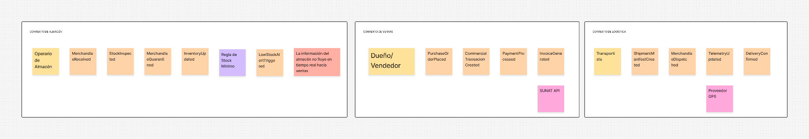

&nbsp;

&nbsp;

**Análisis y Oportunidades:** Al visualizar el flujo completo, el equipo notó que la mayor acumulación de "dolores" y cuellos de botella (representados con post-its rojos de riesgo) ocurría en la transición entre la Fase 1 y la Fase 2\. La información de lo que hay en el almacén no fluye en tiempo real hacia ventas, generando un vacío de información. AI-ToDu actuará como el puente digital que sincronice los eventos InventoryUpdated directamente con PurchaseOrderPlaced.

## **2.5. Ubiquitous Language.**

Para asegurar una comunicación sin ambigüedades entre los expertos del negocio, los usuarios y el equipo de desarrollo, hemos construido nuestro **Lenguaje Ubicuo (Ubiquitous Language)**. Este glosario define los términos centrales del dominio de la logística, almacén y ventas, estandarizando su uso en todos los artefactos, desde los requerimientos hasta el código fuente de AI-ToDu.

* **Inventory Item (Artículo de Inventario):** Producto físico o insumo que se encuentra almacenado dentro del negocio, listo para ser despachado, vendido o utilizado en producción.
* **SKU \- Stock Keeping Unit (Código de Referencia):** Identificador alfanumérico único asignado a un artículo para rastrear su disponibilidad exacta en el almacén.
* **Shipment Manifest (Manifiesto de Despacho):** Documento logístico consolidado que agrupa los artículos que saldrán del almacén, detallando el estado actual del envío y las ubicaciones a visitar.
* **Waypoint (Punto de Ruta):** Ubicación geográfica específica (como el origen, destino o paradas intermedias) que conforma la hoja de ruta de un despacho.
* **Commercial Transaction (Transacción Comercial):** El registro oficial de una venta. Consolida los artículos adquiridos por el cliente, los impuestos aplicados (IGV) y el estado del pago.
* **Quarantine (Cuarentena):** Estado temporal asignado a un artículo de inventario que presenta daños o dudas sobre su calidad. Mientras esté en cuarentena, no puede ser vendido ni despachado.
* **Dimensional Weight (Peso Volumétrico):** Medida logística calculada en base al volumen de un paquete (largo, ancho y alto) que determina el espacio físico real que ocupará en el estante o en el vehículo de transporte.
* **Telemetry (Telemetría):** Conjunto de datos medibles (como latitud, longitud o temperatura) asociados a un manifiesto de despacho, especialmente relevante cuando se transporta mercadería perecible o de alto valor.
* **Stock Out (Quiebre de Stock):** Situación crítica que ocurre cuando se intenta vender o utilizar un artículo cuya cantidad física en el almacén ha llegado a cero.

**Capítulo III: Requirements Specification**

Esta sección consolida la especificación de los requisitos de software que darán vida a AI-ToDu. Para garantizar un desarrollo ágil y centrado en el valor, todo el equipo ha colaborado en la redacción de Epics e Historias de Usuario aplicando estrictamente el acrónimo **INVEST** (Independientes, Negociables, Valiosas, Estimables, Pequeñas y Testeables). Los criterios de aceptación han sido redactados en formato Gherkin (Given-When-Then), omitiendo detalles de interfaz de usuario para permitir flexibilidad en el diseño técnico y funcional.

## **3.1. User Stories**

A continuación, presentamos el cuadro consolidado que incluye nuestros *Epics* principales (que agrupan grandes funcionalidades del sistema), las *User Stories* para el Landing Page (enfocadas en conversión), las *User Stories* de la Web Application (enfocadas en el Core Business) y las *Technical Stories* para el desarrollo de nuestro RESTful API.

| Epic / Story ID | Título | Descripción | Criterios de Aceptación | Relacionado con (Epic ID) |
| ----- | ----- | ----- | ----- | ----- |
| EP01 | Landing Page y Onboarding | **Como** propietario de una MYPE, **quiero** conocer la propuesta de valor de AI-ToDu y configurar inicialmente mi empresa, **para** comenzar a utilizar la plataforma de manera rápida y adecuada a mis necesidades.&nbsp; |  |  |
| US01 | Visualización de Planes&nbsp; | **Como** Visitante MYPE**Quiero** visualizar los planes de suscripción de AI-ToDu**Para** evaluar cuál se adapta mejor a las necesidades de mi negocio. | **Escenario 1 — Visualizar planes Given** que un visitante accede a la sección de precios**When** solicita visualizar los planes disponibles**Then** el sistema muestra los planes con sus características y costos. **Escenario 2 — Seleccionar un plan Given** que el visitante está visualizando los planes**When** selecciona uno de los planes**Then** el sistema muestra la información correspondiente y permite iniciar el registro. **Escenario 3 — Información del plan Given** que el visitante selecciona un plan específico**When** consulta sus características**Then** el sistema muestra las funcionalidades incluidas en dicho plan.&nbsp; | EP01 |
| US02 | Registro de Mercadería | **Como** Operario de Almacén**Quiero** registrar un nuevo artículo de inventario**Para** mantener actualizado el stock de mi negocio. | **Escenario 1 — Registro exitoso Given** que el operario tiene los datos requeridos del artículo**When** registra el SKU, nombre, cantidad y demás información obligatoria**Then** el sistema crea el Inventory Item y actualiza el stock. **Escenario 2 — SKU obligatorio Given** que el operario intenta registrar un artículo**When** envía la solicitud sin un SKU**Then** el sistema rechaza la operación e informa que el SKU es obligatorio. **Escenario 3 — SKU duplicado Given** que ya existe un artículo con determinado SKU**When** el operario intenta registrar otro artículo con el mismo SKU&nbsp; | EP01 |
| US03 | Creación de Venta | **Como** Dueño de Negocio**Quiero** generar una Transacción Comercial**Para** registrar el ingreso y actualizar las existencias del almacén. | **Escenario 1 — Venta con stock disponible Given** que existe un artículo con stock disponible**When** el usuario lo agrega a una Transacción Comercial**Then** el sistema calcula el subtotal y reserva la cantidad correspondiente. **Escenario 2 — Venta sin stock Given** que un artículo se encuentra en Stock Out**When** el usuario intenta agregarlo a una venta**Then** el sistema impide agregarlo e informa que no existe stock disponible. **Escenario 3 — Confirmación de venta Given** que una Transacción Comercial contiene artículos válidos**When** el usuario confirma la venta**Then** el sistema registra la transacción y descuenta las cantidades correspondientes del inventario.&nbsp; | EP01 |
| US04 | Consulta de Stock mediante API | **Como** Developer**Quiero** disponer de un endpoint para consultar el stock mediante SKU**Para** alimentar los componentes de AI-ToDu que requieren información de inventario. | **Escenario 1 — SKU existente Given** que existe un Inventory Item con un SKU válido**When** el cliente realiza una petición GET al endpoint de inventario**Then** el servidor responde con código 200 y la información del stock. **Escenario 2 — SKU inexistente Given** que el SKU solicitado no existe**When** el cliente realiza la petición GET**Then** el servidor responde con código 404 y una estructura de error. **Escenario 3 — SKU inválido Given** que el cliente proporciona un SKU con formato inválido**When** realiza la petición**Then** el servidor rechaza la solicitud e informa el error de validación.&nbsp; | EP01 |
| US05 | Configuración de Roles | **Como** Administrador**Quiero** asignar roles a los usuarios**Para** controlar el acceso a la información y funcionalidades del sistema. | **Escenario 1 — Crear asignación de rol Given** que existe un usuario registrado**When** el administrador le asigna un rol**Then** el sistema guarda la asignación. **Escenario 2 — Acceso autorizado Given** que un usuario tiene un rol con permiso para acceder a un módulo**When** intenta ingresar al módulo**Then** el sistema permite el acceso. **Escenario 3 — Acceso no autorizado Given** que un usuario no posee permiso para un módulo**When** intenta acceder**Then** el sistema deniega el acceso.&nbsp; | EP01 |
| EP02 | Identidad, Usuarios y Seguridad | **Como** administrador de una MYPE, **quiero** gestionar usuarios, roles, permisos y autenticación, **para** controlar de forma segura quién puede acceder y realizar acciones dentro del sistema.&nbsp; |  |  |
| US06 | Registro de Usuarios | **Como** Administrador**Quiero** registrar usuarios dentro de mi organización**Para** permitir que el personal utilice AI-ToDu.&nbsp; | **Escenario 1 — Registro válido Given** que el administrador proporciona datos válidos**When** confirma el registro**Then** el sistema crea el usuario. **Escenario 2 — Correo duplicado Given** que ya existe un usuario con determinado correo**When** el administrador intenta registrarlo nuevamente**Then** el sistema rechaza el registro. **Escenario 3 — Datos incompletos Given** que faltan datos obligatorios**When** el administrador intenta registrar al usuario**Then** el sistema informa los campos requeridos.&nbsp; | EP02 |
| US07 | Inicio de Sesión | **Como** Usuario de AI-ToDu**Quiero** iniciar sesión**Para** acceder de forma segura a las funcionalidades correspondientes a mi rol.&nbsp; | **Escenario 1 — Credenciales válidas Given** que el usuario está registrado**When** proporciona credenciales válidas**Then** el sistema inicia su sesión. **Escenario 2 — Credenciales inválidas Given** que las credenciales proporcionadas no son válidas**When** el usuario intenta iniciar sesión**Then** el sistema rechaza el acceso. **Escenario 3 — Usuario deshabilitado Given** que el usuario se encuentra deshabilitado**When** intenta iniciar sesión**Then** el sistema impide el acceso.&nbsp; | EP02 |
| US08 | Recuperación de Acceso | **Como** Usuario**Quiero** recuperar mi acceso**Para** volver a utilizar AI-ToDu cuando no recuerde mis credenciales.&nbsp; | **Escenario 1 — Solicitud válida Given** que el correo pertenece a un usuario registrado**When** solicita recuperar su acceso**Then** el sistema inicia el proceso de recuperación. **Escenario 2 — Correo inexistente Given** que el correo no pertenece a un usuario registrado**When** solicita recuperar el acceso**Then** el sistema no permite iniciar una recuperación para esa cuenta. **Escenario 3 — Restablecimiento Given** que el usuario dispone de un mecanismo válido de recuperación**When** establece una nueva credencial**Then** el sistema actualiza su acceso.&nbsp; | Ep02 |
| US09 | Gestión de Permisos | **Como** Administrador**Quiero** configurar permisos por módulo**Para** controlar qué operaciones puede realizar cada usuario.&nbsp; | **Como** Administrador**Quiero** configurar permisos por módulo**Para** controlar qué operaciones puede realizar cada usuario. **Escenario 1 — Conceder permiso Given** que existe un usuario con un rol configurado**When** el administrador concede acceso a un módulo**Then** el usuario obtiene el permiso correspondiente. **Escenario 2 — Revocar permiso Given** que un usuario posee acceso a un módulo**When** el administrador revoca dicho permiso**Then** el usuario deja de poder acceder al módulo. **Escenario 3 — Acción restringida Given** que un usuario no tiene permiso para una operación**When** intenta ejecutarla**Then** el sistema rechaza la acción.&nbsp; | EP02 |
| US10 | Auditoría de Acciones | **Como** Administrador**Quiero** consultar las acciones realizadas por los usuarios**Para** mantener trazabilidad sobre las operaciones del negocio.&nbsp; | **Como** Administrador**Quiero** consultar las acciones realizadas por los usuarios**Para** mantener trazabilidad sobre las operaciones del negocio. **Escenario 1 — Registrar acción Given** que un usuario ejecuta una operación relevante**When** la operación finaliza**Then** el sistema registra quién, cuándo y qué operación realizó. **Escenario 2 — Consultar historial Given** que existen acciones registradas**When** el administrador consulta el historial**Then** el sistema muestra las operaciones disponibles. **Escenario 3 — Filtrar historial Given** que existen múltiples registros de auditoría**When** el administrador aplica filtros**Then** el sistema muestra únicamente los registros coincidentes.&nbsp; | EP02 |
| EP03 | Inventario y Almacén | **Como** encargado de almacén, **quiero** gestionar productos, existencias, ubicaciones, lotes, vencimientos y movimientos de inventario, **para** mantener un control actualizado y confiable de la mercadería.&nbsp; |  |  |
| US11 | Actualización de Stock | **Como** Operario de Almacén**Quiero** actualizar las cantidades de los artículos**Para** mantener el inventario sincronizado con las existencias físicas.&nbsp; | **Escenario 1 — Incrementar stock Given** que existe un Inventory Item**When** se registra una entrada de mercadería**Then** el sistema incrementa su stock. **Escenario 2 — Disminuir stock Given** que existe stock disponible**When** se registra una salida válida**Then** el sistema disminuye la cantidad disponible. **Escenario 3 — Cantidad inválida Given** que se intenta registrar una cantidad negativa o inválida**When** se procesa la actualización**Then** el sistema rechaza la operación.&nbsp; | EP03 |
| US12 | Búsqueda de Productos | **Como** Operario de Almacén**Quiero** buscar productos rápidamente**Para** encontrar su información sin revisar manualmente todo el inventario.&nbsp; | **Escenario 1 — Buscar por SKU Given** que existe un artículo con un SKU determinado**When** el operario busca utilizando dicho SKU**Then** el sistema muestra el artículo correspondiente. **Escenario 2 — Buscar por nombre Given** que existen artículos registrados**When** el operario busca utilizando parte del nombre**Then** el sistema muestra los artículos coincidentes. **Escenario 3 — Sin resultados Given** que no existen artículos que coincidan con la búsqueda**When** el operario realiza la consulta**Then** el sistema informa que no se encontraron resultados.&nbsp; | EP03 |
| US13 | Ubicación Física del Inventario | **Como** Operario de Almacén**Quiero** registrar la ubicación física de cada artículo**Para** encontrar rápidamente la mercadería dentro del almacén.&nbsp; | **Escenario 1 — Asignar ubicación Given** que existe un Inventory Item**When** el operario registra su ubicación física**Then** el sistema almacena dicha ubicación. **Escenario 2 — Consultar ubicación Given** que un artículo tiene una ubicación registrada**When** el operario consulta el artículo**Then** el sistema muestra su ubicación. **Escenario 3 — Cambiar ubicación Given** que un artículo posee una ubicación registrada**When** el operario actualiza su ubicación**Then** el sistema guarda la nueva ubicación.&nbsp; | EP03 |
| US14 | Control de Lotes | **Como** Operario de Almacén**Quiero** asociar lotes a la mercadería**Para** mantener trazabilidad sobre los productos almacenados.&nbsp; | **Escenario 1 — Registrar lote Given** que se recibe mercadería perteneciente a un lote**When** el operario registra la entrada**Then** el sistema asocia la mercadería al lote. **Escenario 2 — Consultar lote Given** que existen artículos asociados a un lote**When** el usuario consulta el lote**Then** el sistema muestra los artículos relacionados. **Escenario 3 — Lote inexistente Given** que el usuario solicita un lote inexistente**When** realiza la consulta**Then** el sistema informa que no existen registros para dicho lote.&nbsp; | EP03 |
| US15 | Control de Productos Perecible | **Como** Operario de Almacén**Quiero** registrar fechas de vencimiento**Para** controlar los productos perecibles y evitar pérdidas.&nbsp; | **Escenario 1 — Registrar vencimiento Given** que el producto es perecible**When** el operario registra su fecha de vencimiento**Then** el sistema almacena la fecha. **Escenario 2 — Producto próximo a vencer Given** que un producto se aproxima a su fecha de vencimiento**When** el sistema evalúa sus datos**Then** identifica el producto para su seguimiento. **Escenario 3 — Producto vencido Given** que la fecha de vencimiento de un producto ya pasó**When** el sistema actualiza su estado**Then** el producto queda identificado como no disponible para venta o despacho.&nbsp; | EP03 |
| US16 | Gestión de Cuarentena | **Como** Operario de Almacén**Quiero** colocar mercadería en cuarentena**Para** evitar vender o despachar productos cuya condición de calidad esté en duda.&nbsp; | **Escenario 1 — Enviar a cuarentena Given** que un artículo presenta daños o dudas sobre su calidad**When** el operario lo marca como cuarentena**Then** el sistema cambia su estado a Quarantine. **Escenario 2 — Impedir venta Given** que un artículo está en cuarentena**When** un usuario intenta venderlo**Then** el sistema impide incluirlo en la transacción. **Escenario 3 — Liberar cuarentena Given** que un artículo se encuentra en cuarentena**When** un usuario autorizado aprueba su liberación**Then** el sistema actualiza su estado para permitir nuevamente su utilización.&nbsp; | EP03 |
| US17 | Ajuste de Inventario | **Como** Jefe de Almacén**Quiero** realizar ajustes de inventario**Para** corregir diferencias entre el stock físico y el registrado.&nbsp; | **Escenario 1 — Ajuste positivo Given** que el conteo físico es mayor al stock registrado**When** el responsable registra un ajuste positivo**Then** el sistema actualiza el stock. **Escenario 2 — Ajuste negativo Given** que el conteo físico es menor al stock registrado**When** el responsable registra un ajuste negativo**Then** el sistema reduce el stock. **Escenario 3 — Trazabilidad Given** que se realiza un ajuste**When** la operación es confirmada**Then** el sistema registra el motivo y responsable del ajuste.&nbsp; | EP03 |
| US18 | Inventario Físico | **Como** Jefe de Almacén**Quiero** realizar un conteo físico de inventario**Para** comparar las existencias reales con las registradas en AI-ToDu.&nbsp; | **Escenario 1 — Iniciar conteo Given** que el responsable necesita verificar el inventario**When** inicia un conteo físico**Then** el sistema genera el proceso de conteo. **Escenario 2 — Registrar cantidades Given** que existe un proceso de conteo activo**When** el operario registra las cantidades encontradas**Then** el sistema almacena los resultados. **Escenario 3 — Comparar diferencias Given** que finalizó el conteo físico**When** el sistema compara las cantidades**Then** identifica las diferencias entre stock físico y registrado.&nbsp; | EP03 |
| US19 | Lectura de Código de Barras | **Como** Operario de Almacén**Quiero** identificar artículos mediante código de barras**Para** acelerar las operaciones de inventario.&nbsp; | **Escenario 1 — Código válido Given** que un artículo posee un código registrado**When** el operario lo escanea**Then** el sistema identifica el Inventory Item. **Escenario 2 — Código inexistente Given** que el código escaneado no está registrado**When** el sistema intenta identificarlo**Then** informa que no existe un artículo asociado. **Escenario 3 — Registro mediante escaneo Given** que el código corresponde a un artículo válido**When** el operario lo utiliza durante una entrada**Then** el sistema permite registrar la operación sobre dicho artículo.&nbsp; | EP03 |
| EP04 | Compras y Abastecimiento | **Como** encargado de compras, **quiero** gestionar proveedores, órdenes de compra, aprobaciones, recepción e inspección de mercadería, **para** asegurar un abastecimiento ordenado y mantener actualizado el inventario.&nbsp; | &nbsp; |  |
| US20 | Registro de Proveedores | **Como** Administrador**Quiero** registrar proveedores**Para** mantener organizada la información de abastecimiento.&nbsp; | **Escenario 1 — Registrar proveedor Given** que el administrador posee los datos requeridos**When** registra un proveedor**Then** el sistema crea el registro. **Escenario 2 — Actualizar proveedor Given** que existe un proveedor registrado**When** el administrador modifica sus datos**Then** el sistema actualiza la información. **Escenario 3 — Buscar proveedor Given** que existen proveedores registrados**When** el administrador realiza una búsqueda**Then** el sistema muestra los proveedores coincidentes. | EP04 |
| US21 | Generación de Orden de Compra | **Como** Responsable de Abastecimiento**Quiero** generar una Purchase Order**Para** solicitar mercadería a un proveedor.&nbsp; | **Escenario 1 — Crear orden Given** que existe un proveedor activo**When** el responsable crea una orden de compra con productos**Then** el sistema registra la Purchase Order. **Escenario 2 — Producto sin cantidad Given** que una orden contiene un producto sin cantidad válida**When** se intenta confirmar la orden**Then** el sistema rechaza la operación. **Escenario 3 — Confirmar orden Given** que la orden contiene información válida**When** el responsable la confirma**Then** el sistema cambia su estado a confirmada.&nbsp; | EP04 |
| US22 | Aprobación de Compras | **Como** Dueño de Negocio**Quiero** aprobar las órdenes de compra**Para** controlar las adquisiciones realizadas por el negocio.&nbsp; | **Escenario 1 — Aprobar orden Given** que existe una orden pendiente**When** el dueño la aprueba**Then** el sistema cambia su estado a aprobada. **Escenario 2 — Rechazar orden Given** que existe una orden pendiente**When** el dueño decide rechazarla**Then** el sistema cambia su estado a rechazada. **Escenario 3 — Usuario sin permiso Given** que un usuario no posee autorización para aprobar compras**When** intenta aprobar una orden**Then** el sistema rechaza la acción.&nbsp; | EP04 |
| US23 | Recepción de Mercadería | **Como** Operario de Almacén**Quiero** registrar la recepción de mercadería**Para** actualizar el inventario cuando llega un pedido.&nbsp; | **Escenario 1 — Recepción completa Given** que existe una orden de compra aprobada**When** llega toda la mercadería solicitada**Then** el sistema registra MerchandiseReceived y actualiza el inventario. **Escenario 2 — Recepción parcial Given** que llega una cantidad menor a la solicitada**When** el operario registra la recepción**Then** el sistema registra únicamente la cantidad recibida. **Escenario 3 — Mercadería dañada Given** que parte de la mercadería presenta daños**When** el operario realiza la inspección**Then** el sistema permite identificar dicha mercadería para cuarentena.&nbsp; | EP04 |
| US24 | Inspección de Mercadería | **Como** Operario de Almacén**Quiero** inspeccionar la mercadería recibida**Para** verificar su condición antes de incorporarla al stock disponible.&nbsp; | **Escenario 1 — Mercadería conforme Given** que la mercadería recibida cumple las condiciones esperadas**When** finaliza la inspección**Then** el sistema registra StockInspected y permite incorporarla al inventario. **Escenario 2 — Mercadería observada Given** que una mercadería presenta daños o inconsistencias**When** finaliza la inspección**Then** el sistema la identifica como observada. **Escenario 3 — Cuarentena Given** que una mercadería no debe estar disponible para venta**When** el responsable determina su cuarentena**Then** el sistema la coloca en estado Quarantine.&nbsp; | EP04 |
| EP05 | Ventas y Transacciones | **Como** vendedor, **quiero** gestionar clientes, productos, ventas, pagos y comprobantes, **para** realizar transacciones de manera rápida y mantener sincronizada la información comercial con el inventario.&nbsp; | &nbsp; |  |
| US25 | Gestión de Clientes | **Como** Vendedor**Quiero** registrar clientes**Para** asociarlos a las transacciones comerciales.&nbsp; | **Escenario 1 — Crear cliente Given** que el vendedor posee los datos requeridos**When** registra un nuevo cliente**Then** el sistema crea el registro. **Escenario 2 — Buscar cliente Given** que existen clientes registrados**When** el vendedor busca un cliente**Then** el sistema muestra los registros coincidentes. **Escenario 3 — Cliente existente Given** que ya existe un cliente con el identificador proporcionado**When** el vendedor intenta registrarlo nuevamente**Then** el sistema evita duplicar el registro.&nbsp; | EP05 |
| US26 | Carrito de Venta | **Como** Vendedor**Quiero** agregar productos a una venta**Para** preparar una Transacción Comercial.&nbsp; | **Escenario 1 — Agregar producto Given** que el producto tiene stock disponible**When** el vendedor lo agrega al carrito**Then** el sistema incorpora el producto a la transacción. **Escenario 2 — Modificar cantidad Given** que un producto está en el carrito**When** el vendedor modifica su cantidad**Then** el sistema recalcula el importe correspondiente. **Escenario 3 — Eliminar producto Given** que un producto está en el carrito**When** el vendedor lo elimina**Then** el sistema actualiza la transacción sin dicho producto. | EP05 |
| US27 | Procesamiento de Pago | **Como** Vendedor**Quiero** registrar el pago de una venta**Para** completar la Transacción Comercial.&nbsp; | **Escenario 1 — Pago exitoso Given** que existe una venta válida**When** se procesa correctamente el pago**Then** el sistema registra Payment Processed. **Escenario 2 — Pago rechazado Given** que existe una venta pendiente**When** el medio de pago rechaza la operación**Then** el sistema mantiene la venta pendiente y registra el rechazo. **Escenario 3 — Pago completo Given** que el monto recibido cubre el total de la venta**When** se confirma el pago**Then** el sistema marca la transacción como pagada.&nbsp; | EP05 |
| US28 | Generación de Comprobante | **Como** Vendedor**Quiero** generar el comprobante de la venta**Para** entregar al cliente el documento correspondiente.&nbsp; | **Escenario 1 — Generar comprobante Given** que una venta fue confirmada**When** se solicita la generación del comprobante**Then** el sistema genera el documento correspondiente. **Escenario 2 — Venta pendiente Given** que una venta aún no está confirmada**When** se intenta generar el comprobante**Then** el sistema impide la generación. **Escenario 3 — Registro de comprobante Given** que el comprobante fue generado**When** finaliza la operación**Then** el sistema registra Invoice Generated asociado a la venta.&nbsp; | EP05 |
| US29 | Consulta de Historial de Ventas | **Como** Dueño de Negocio**Quiero** consultar el historial de ventas**Para** analizar las operaciones comerciales realizadas.&nbsp; | **Escenario 1 — Consultar ventas Given** que existen ventas registradas**When** el usuario consulta el historial**Then** el sistema muestra las transacciones. **Escenario 2 — Filtrar por fecha Given** que existen ventas de diferentes fechas**When** el usuario aplica un rango de fechas**Then** el sistema muestra las ventas correspondientes. **Escenario 3 — Consultar detalle Given** que existe una venta registrada**When** el usuario selecciona la transacción**Then** el sistema muestra sus productos, pago y comprobante.&nbsp; | EP05 |
| US30 | Sincronización Venta-Inventario | **Como** Dueño de Negocio**Quiero** que las ventas actualicen automáticamente el inventario**Para** mantener sincronizadas las operaciones comerciales y las existencias.&nbsp; | **Escenario 1 — Venta confirmada Given** que una venta fue confirmada**When** se completa la transacción**Then** el sistema descuenta las unidades vendidas del inventario. **Escenario 2 — Venta cancelada Given** que una venta había reservado stock**When** la venta es cancelada**Then** el sistema libera las unidades reservadas. **Escenario 3 — Stock actualizado Given** que una venta modifica la cantidad disponible**When** finaliza la operación**Then** el sistema registra InventoryUpdated.&nbsp; | EP05 |
| EP06 | Despacho y Distribución | **Como** encargado de despacho, **quiero** gestionar manifiestos, asignación de mercadería, rutas, despachos y seguimiento de entregas, **para** asegurar que los pedidos sean preparados, enviados y monitoreados correctamente.&nbsp; |  |  |
| US31 | Creación de Manifiesto de Despacho | **Como** Responsable de Despacho**Quiero** crear un Shipment Manifest**Para** organizar la mercadería que será enviada.&nbsp; | **Escenario 1 — Crear manifiesto Given** que existen productos disponibles para despacho**When** el responsable crea un manifiesto**Then** el sistema registra el Shipment Manifest. **Escenario 2 — Producto no disponible Given** que un producto no tiene stock suficiente**When** se intenta incluirlo en el manifiesto**Then** el sistema impide su asignación. **Escenario 3 — Manifiesto completo Given** que el manifiesto contiene toda la información requerida**When** el responsable lo confirma**Then** el sistema cambia su estado a preparado.&nbsp; | EP06 |
| US32 | Asignación de Mercadería | **Como** Operario de Despacho**Quiero** asignar mercadería a un despacho**Para** asegurar que los productos correctos sean enviados.&nbsp; | **Escenario 1 — Asignar producto Given** que existe stock disponible**When** el operario asigna un producto al despacho**Then** el sistema registra la asignación. **Escenario 2 — Cantidad insuficiente Given** que la cantidad disponible es menor a la solicitada**When** el operario intenta asignarla**Then** el sistema rechaza la cantidad excedente. **Escenario 3 — Producto en cuarentena Given** que el producto se encuentra en Quarantine**When** el operario intenta asignarlo**Then** el sistema impide la asignación.&nbsp; | EP06 |
| US33 | Selección de Ruta | **Como** Responsable de Despacho**Quiero** seleccionar una ruta para el envío**Para** organizar la distribución de la mercadería.&nbsp; | **Escenario 1 — Seleccionar ruta Given** que existe un despacho preparado**When** el responsable selecciona una ruta**Then** el sistema la asocia al manifiesto. **Escenario 2 — Modificar ruta Given** que un manifiesto posee una ruta asignada**When** el responsable selecciona una nueva ruta**Then** el sistema actualiza la ruta. **Escenario 3 — Ruta no disponible Given** que una ruta no puede utilizarse**When** el responsable intenta asignarla**Then** el sistema informa que la ruta no está disponible.&nbsp; | EP06 |
| US34 | Confirmación de Despacho | **Como** Operario de Despacho**Quiero** confirmar la salida de la mercadería**Para** registrar formalmente el despacho.&nbsp; | **Escenario 1 — Confirmar despacho Given** que el manifiesto está preparado**When** el operario confirma la salida**Then** el sistema registra MerchandiseDispatched. **Escenario 2 — Manifiesto incompleto Given** que el manifiesto carece de información obligatoria**When** el operario intenta confirmarlo**Then** el sistema rechaza la confirmación. **Escenario 3 — Actualizar inventario Given** que el despacho fue confirmado**When** finaliza la operación**Then** el sistema descuenta del inventario la mercadería despachada.&nbsp; | EP06 |
| US35 | Seguimiento de Despacho | **Como** Dueño de Negocio**Quiero** consultar el estado de los despachos**Para** conocer el avance de las entregas.&nbsp; | **Escenario 1 — Consultar estado Given** que existe un despacho registrado**When** el usuario consulta su seguimiento**Then** el sistema muestra su estado actual. **Escenario 2 — Actualización de estado Given** que el despacho cambia de etapa**When** se registra el nuevo estado**Then** el sistema actualiza el seguimiento. **Escenario 3 — Entrega confirmada Given** que la mercadería fue entregada**When** se confirma la recepción**Then** el sistema registra DeliveryConfirmed.&nbsp; | EP06 |
| US36 | Registro de Telemetría | **Como** Responsable de Logística**Quiero** registrar datos de telemetría del despacho**Para** conocer información relevante durante el transporte.&nbsp; | **Escenario 1 — Registrar ubicación Given** que un despacho tiene telemetría disponible**When** se recibe una actualización de ubicación**Then** el sistema registra los datos de latitud y longitud. **Escenario 2 — Registrar temperatura Given** que un despacho transporta mercadería que requiere control de temperatura**When** se recibe una medición**Then** el sistema registra la temperatura asociada al despacho. **Escenario 3 — Actualizar telemetría Given** que existe un Shipment Manifest activo**When** llega nueva información de telemetría**Then** el sistema registra TelemetryUpdated.&nbsp; | EP06 |
| EP07 | Mermas, Devoluciones y Ajustes | **Como** encargado de almacén, **quiero** registrar mermas, devoluciones y ajustes de inventario con sus respectivos motivos, **para** mantener la trazabilidad de las diferencias entre el inventario registrado y el inventario físico.&nbsp; |  |  |
| US37 | Registro de Merma | **Como** Operario de Almacén**Quiero** registrar una merma**Para** mantener control sobre las pérdidas de inventario.&nbsp; | **Escenario 1 — Registrar merma Given** que existe un producto afectado**When** el operario registra una merma**Then** el sistema descuenta la cantidad correspondiente. **Escenario 2 — Motivo obligatorio Given** que el operario intenta registrar una merma**When** no especifica el motivo**Then** el sistema rechaza el registro. **Escenario 3 — Trazabilidad Given** que la merma fue registrada**When** finaliza la operación**Then** el sistema guarda el responsable, fecha, producto y motivo.&nbsp; | EP07 |
| US38 | Gestión de Devoluciones | **Como** Vendedor**Quiero** registrar devoluciones de productos**Para** mantener actualizadas las ventas y existencias.&nbsp; | **Escenario 1 — Registrar devolución Given** que existe una venta válida**When** el vendedor registra una devolución**Then** el sistema crea el registro correspondiente. **Escenario 2 — Devolución no válida Given** que no existe una venta asociada**When** se intenta registrar la devolución**Then** el sistema rechaza la operación. **Escenario 3 — Actualización de stock Given** que una devolución fue aceptada**When** finaliza el proceso**Then** el sistema actualiza el inventario según la condición del producto.&nbsp; | EP07 |
| US39 | Clasificación de Producto Devuelto | **Como** Operario de Almacén**Quiero** clasificar los productos devueltos**Para** determinar si pueden volver al stock disponible.&nbsp; | **Escenario 1 — Producto apto Given** que un producto devuelto está en buenas condiciones**When** el operario lo inspecciona**Then** puede ser reincorporado al inventario disponible. **Escenario 2 — Producto dañado Given** que un producto devuelto presenta daños**When** se completa la inspección**Then** el sistema permite enviarlo a cuarentena o merma. **Escenario 3 — Producto no apto Given** que un producto no puede volver a venderse**When** se registra la clasificación**Then** el sistema evita que vuelva al stock disponible.&nbsp; | EP07 |
| US40 | Motivos de Ajuste | **Como** Administrador**Quiero** definir motivos para los ajustes de inventario**Para** mantener una clasificación consistente de las diferencias.&nbsp; | **Escenario 1 — Crear motivo Given** que el administrador posee permisos**When** registra un nuevo motivo**Then** el sistema crea la opción disponible. **Escenario 2 — Utilizar motivo Given** que existe un motivo configurado**When** un usuario realiza un ajuste**Then** puede asociar dicho motivo a la operación. **Escenario 3 — Motivo inactivo Given** que un motivo está inactivo**When** un usuario intenta utilizarlo**Then** el sistema no lo permite para nuevos ajustes.&nbsp; | EP07 |
| US41 | Reporte de Mermas y Diferencias | **Como** Dueño de Negocio**Quiero** consultar las mermas y diferencias de inventario**Para** identificar pérdidas del negocio.&nbsp; | **Escenario 1 — Consultar mermas Given** que existen registros de merma**When** el dueño consulta el reporte**Then** el sistema muestra las mermas registradas. **Escenario 2 — Filtrar período Given** que existen registros de diferentes períodos**When** el usuario selecciona un rango de fechas**Then** el sistema muestra únicamente los registros correspondientes. **Escenario 3 — Resumen de pérdidas Given** que existen mermas registradas**When** se genera el resumen**Then** el sistema muestra las cantidades y valores asociados.&nbsp; | EP07 |
| EP08 | Dashboard, Reportes y Finanzas | **Como** propietario o administrador de una MYPE, **quiero** consultar dashboards y reportes de inventario, ventas, finanzas y rentabilidad, **para** obtener información que facilite el seguimiento y análisis de las operaciones del negocio.&nbsp; |  |  |
| US42 | Dashboard General | **Como** Dueño de Negocio**Quiero** visualizar un dashboard del estado del negocio**Para** monitorear la operación sin depender de reportes manuales.&nbsp; | **Escenario 1 — Visualizar indicadores Given** que existen datos operativos registrados**When** el dueño ingresa al dashboard**Then** el sistema muestra indicadores relevantes del negocio. **Escenario 2 — Datos actualizados Given** que se registra una nueva operación**When** el dashboard actualiza la información**Then** los indicadores reflejan los nuevos datos. **Escenario 3 — Acceso por rol Given** que el usuario posee permisos de gestión**When** accede al dashboard**Then** el sistema permite visualizar los indicadores correspondientes.&nbsp; | EP08 |
| US43 | Dashboard de Inventario | **Como** Jefe de Almacén**Quiero** visualizar indicadores de inventario**Para** detectar problemas de stock.&nbsp; | **Escenario 1 — Stock actual Given** que existen artículos registrados**When** el usuario consulta el dashboard**Then** el sistema muestra información sobre las existencias. **Escenario 2 — Stock mínimo Given** que existen artículos por debajo de su stock mínimo**When** se consulta el dashboard**Then** el sistema identifica dichos artículos. **Escenario 3 — Stock Out Given** que existen productos con cantidad cero**When** el usuario consulta el dashboard**Then** el sistema identifica los productos en Stock Out.&nbsp; | EP08 |
| US44 | Reporte de Ventas | **Como** Dueño de Negocio**Quiero** generar reportes de ventas**Para** analizar el comportamiento comercial.&nbsp; | **Escenario 1 — Generar reporte Given** que existen transacciones comerciales**When** el usuario solicita un reporte**Then** el sistema genera el reporte correspondiente. **Escenario 2 — Filtrar ventas Given** que existen ventas de diferentes períodos**When** el usuario aplica filtros**Then** el sistema muestra las ventas coincidentes. **Escenario 3 — Resumen Given** que existe un conjunto de ventas seleccionado**When** el sistema procesa el reporte**Then** muestra totales y métricas correspondientes.&nbsp; | EP08 |
| US45 | Reporte Financiero | **Como** Dueño de Negocio**Quiero** consultar información financiera consolidada**Para** conocer el comportamiento económico del negocio.&nbsp; | **Escenario 1 — Ingresos Given** que existen ventas registradas**When** el usuario consulta el reporte financiero**Then** el sistema muestra los ingresos correspondientes. **Escenario 2 — Egresos Given** que existen compras u operaciones registradas como egresos**When** el usuario consulta el reporte**Then** el sistema muestra los egresos correspondientes. **Escenario 3 — Consolidación Given** que existen ingresos y egresos registrados**When** se genera el reporte**Then** el sistema presenta la información consolidada del período seleccionado.&nbsp; | EP08 |
| US46 | Rentabilidad | **Como** Dueño de Negocio**Quiero** visualizar indicadores de rentabilidad**Para** evaluar el resultado económico de mis operaciones.&nbsp; | **Escenario 1 — Calcular resultado Given** que existen ingresos y costos registrados**When** el sistema procesa los datos**Then** calcula el resultado correspondiente. **Escenario 2 — Filtrar período Given** que existen datos de diferentes períodos**When** el usuario selecciona un período**Then** el sistema recalcula los indicadores para ese período. **Escenario 3 — Actualización Given** que se registra una nueva operación financiera**When** el sistema actualiza los indicadores**Then** el resultado refleja la nueva información.&nbsp; | EP08 |
| US47 | Exportación de Reportes | **Como** Dueño de Negocio**Quiero** exportar reportes**Para** utilizar la información fuera de AI-ToDu.&nbsp; | **Escenario 1 — Exportar reporte Given** que existe un reporte generado**When** el usuario solicita su exportación**Then** el sistema genera el archivo correspondiente. **Escenario 2 — Exportar datos filtrados Given** que el usuario aplicó filtros**When** exporta el reporte**Then** el archivo contiene únicamente los datos filtrados. **Escenario 3 — Reporte sin datos Given** que los filtros no producen resultados**When** el usuario solicita exportar**Then** el sistema informa que no existen datos para exportar.&nbsp; | EP08 |
| EP09 | Alertas y Automatización | **Como** administrador de una MYPE, **quiero** recibir alertas y automatizar tareas relacionadas con inventario y operaciones, **para** detectar situaciones importantes oportunamente y reducir controles manuales.&nbsp; |  |  |
| US48 | Alertas de Vencimiento | **Como** Operario de Almacén**Quiero** recibir alertas sobre productos próximos a vencer**Para** tomar acciones antes de que se conviertan en merma.&nbsp; | **Escenario 1 — Próximo vencimiento Given** que un producto se aproxima a su fecha de vencimiento**When** el sistema ejecuta la evaluación**Then** genera una alerta. **Escenario 2 — Producto vigente Given** que un producto está fuera del período de alerta**When** el sistema evalúa su vencimiento**Then** no genera una alerta. **Escenario 3 — Producto vencido Given** que un producto ya superó su fecha de vencimiento**When** el sistema realiza la evaluación**Then** genera una alerta de vencimiento.&nbsp; | EP09 |
| US50 | Centro de Notificaciones | **Como** Usuario**Quiero** consultar mis alertas y notificaciones**Para** conocer eventos importantes del sistema.&nbsp; | **Escenario 1 — Nueva notificación Given** que ocurre un evento que requiere atención**When** el sistema genera la notificación**Then** la muestra al usuario correspondiente. **Escenario 2 — Marcar como leída Given** que existe una notificación pendiente**When** el usuario la consulta**Then** el sistema puede marcarla como leída. **Escenario 3 — Historial Given** que existen notificaciones anteriores**When** el usuario consulta el centro de notificaciones**Then** el sistema muestra su historial.&nbsp; | EP09 |
| US51 | Automatización de Reabastecimiento | **Como** Dueño de Negocio**Quiero** recibir sugerencias de reabastecimiento**Para** reducir el riesgo de quiebres de stock.&nbsp; | **Escenario 1 — Detectar necesidad Given** que un producto alcanza su nivel mínimo**When** el sistema analiza el inventario**Then** identifica la necesidad de reabastecimiento. **Escenario 2 — Sugerir compra Given** que existe una necesidad de reabastecimiento**When** el sistema genera una recomendación**Then** muestra el producto y cantidad sugerida. **Escenario 3 — Sin necesidad Given** que todos los productos tienen stock suficiente**When** el sistema evalúa el inventario**Then** no genera sugerencias de reabastecimiento.&nbsp; | EP09 |
| US52 | Automatización de Procesos | **Como** Administrador**Quiero** configurar procesos automáticos**Para** reducir tareas operativas repetitivas.&nbsp; | **Escenario 1 — Ejecutar proceso Given** que existe una automatización configurada**When** se cumple su condición de ejecución**Then** el sistema ejecuta la acción correspondiente. **Escenario 2 — Automatización deshabilitada Given** que una automatización está deshabilitada**When** se cumple su condición**Then** el sistema no ejecuta la acción. **Escenario 3 — Registro de ejecución Given** que una automatización fue ejecutada**When** finaliza el proceso**Then** el sistema registra su ejecución.&nbsp; | EP09 |
| EP10 | Integraciones, IA e IoT | **Como** administrador de una MYPE, **quiero** integrar servicios externos, dispositivos IoT y funcionalidades de inteligencia artificial, **para** obtener información automatizada y mejorar el análisis y la gestión de las operaciones.&nbsp; |  |  |
| US53 | Integración con Servicios Externos | **Como** Administrador**Quiero** conectar AI-ToDu con servicios externos**Para** ampliar las capacidades de la plataforma.&nbsp; | **Escenario 1 — Configurar integración Given** que existe un servicio compatible**When** el administrador configura sus credenciales**Then** el sistema registra la integración. **Escenario 2 — Integración válida Given** que las credenciales son correctas**When** el sistema prueba la conexión**Then** confirma que la integración está disponible. **Escenario 3 — Integración inválida Given** que las credenciales son incorrectas**When** el sistema prueba la conexión**Then** informa que la integración no pudo establecerse.&nbsp; | EP10 |
| US54 | Integración de Telemetría IoT | **Como** Responsable de Logística**Quiero** recibir información de dispositivos IoT**Para** monitorear las condiciones de los despachos.&nbsp; | **Escenario 1 — Recibir telemetría Given** que existe un dispositivo IoT conectado**When** envía información al sistema**Then** AI-ToDu registra la telemetría. **Escenario 2 — Asociar dispositivo Given** que existe un dispositivo autorizado**When** el administrador lo asocia a un despacho**Then** el sistema vincula sus datos al Shipment Manifest. **Escenario 3 — Dispositivo no autorizado Given** que un dispositivo no está registrado**When** intenta enviar datos**Then** el sistema rechaza la información.&nbsp; | EP10 |
| US55 | Detección de Anomalías de Inventario | **Como** Dueño de Negocio**Quiero** detectar comportamientos anómalos en el inventario**Para** identificar posibles pérdidas o inconsistencias.&nbsp; | **Escenario 1 — Detectar anomalía Given** que existen suficientes datos históricos**When** el sistema identifica un comportamiento inusual**Then** genera una alerta o indicador de anomalía. **Escenario 2 — Comportamiento normal Given** que el comportamiento observado está dentro de los patrones esperados**When** el sistema analiza los datos**Then** no genera una alerta de anomalía. **Escenario 3 — Consultar anomalía Given** que existe una anomalía detectada**When** el usuario consulta el detalle**Then** el sistema muestra la información relacionada.&nbsp; | EP10 |
| US56 | Predicción de Demanda | **Como** Dueño de Negocio**Quiero** consultar estimaciones de demanda**Para** apoyar mis decisiones de abastecimiento.&nbsp; | **Escenario 1 — Generar predicción Given** que existen suficientes datos históricos de ventas**When** el sistema ejecuta el análisis**Then** genera una estimación de demanda. **Escenario 2 — Datos insuficientes Given** que no existen suficientes datos históricos**When** el sistema intenta generar una predicción**Then** informa que la estimación no puede realizarse con suficiente información. **Escenario 3 — Consultar predicción Given** que existe una predicción generada**When** el dueño consulta el resultado**Then** el sistema muestra la estimación correspondiente.&nbsp; | EP10 |
| US57 | Sugerencias Inteligentes de Compra | **Como** Responsable de Abastecimiento**Quiero** recibir sugerencias inteligentes de compra**Para** apoyar la planificación de pedidos.&nbsp; | **Escenario 1 — Generar sugerencia Given** que existen datos de ventas e inventario**When** el sistema analiza la información**Then** genera sugerencias de productos a comprar. **Escenario 2 — Producto sin necesidad Given** que un producto posee stock suficiente**When** el sistema analiza su situación**Then** evita sugerir una compra innecesaria. **Escenario 3 — Consultar sugerencia Given** que existen recomendaciones disponibles**When** el responsable consulta las sugerencias**Then** el sistema muestra los productos y cantidades propuestas.&nbsp; | EP10 |
| US58 | Análisis Inteligentes de Operaciones | **Como** Dueño de Negocio**Quiero** obtener análisis automatizados sobre mis operaciones**Para** identificar oportunidades de mejora.&nbsp; | **Escenario 1 — Generar análisis Given** que existen datos suficientes de las operaciones**When** el sistema ejecuta el análisis**Then** genera información sobre patrones relevantes. **Escenario 2 — Identificar indicador crítico Given** que existe un comportamiento que requiere atención**When** el sistema analiza los datos**Then** identifica el indicador correspondiente. **Escenario 3 — Consultar análisis Given** que existe un análisis generado**When** el dueño consulta el resultado**Then** el sistema muestra los hallazgos disponibles.&nbsp; | EP10 |
| EP11 | Suscripciones y Administración SaaS | **Como** propietario de una MYPE, **quiero** gestionar mi suscripción, plan y límites de uso de AI-ToDu, **para** utilizar la plataforma de acuerdo con las necesidades y condiciones de mi negocio.&nbsp; |  |  |
| US59 | Registro de Suscripción | **Como** Administrador de una MYPE**Quiero** registrar una suscripción**Para** utilizar las funcionalidades de AI-ToDu.&nbsp; | **Como** Administrador de una MYPE**Quiero** registrar una suscripción**Para** utilizar las funcionalidades de AI-ToDu. **Escenario 1 — Suscripción activa Given** que el usuario seleccionó un plan válido**When** completa el proceso de suscripción**Then** el sistema crea la suscripción. **Escenario 2 — Plan seleccionado Given** que el usuario está evaluando los planes**When** selecciona uno**Then** el sistema asocia el proceso de registro con dicho plan. **Escenario 3 — Suscripción registrada Given** que el proceso de suscripción finalizó correctamente**When** el sistema confirma la operación**Then** la cuenta queda asociada al plan seleccionado.&nbsp; | EP11 |
| US60 | Gestión de Planes | **Como** Administrador SaaS**Quiero** gestionar los planes disponibles**Para** controlar la oferta comercial de AI-ToDu.&nbsp; | **Como** Administrador SaaS**Quiero** gestionar los planes disponibles**Para** controlar la oferta comercial de AI-ToDu. **Escenario 1 — Crear plan Given** que el administrador SaaS tiene permisos**When** registra un nuevo plan**Then** el sistema crea el plan. **Escenario 2 — Actualizar plan Given** que existe un plan**When** el administrador modifica sus características**Then** el sistema actualiza la información. **Escenario 3 — Desactivar plan Given** que existe un plan que ya no debe ofrecerse**When** el administrador lo desactiva**Then** el plan deja de estar disponible para nuevas suscripciones.&nbsp; | EP11 |
| US61 | Control de Límites por Plan | **Como** Administrador SaaS**Quiero** establecer límites según el plan contratado**Para** controlar el uso de los recursos de AI-ToDu.&nbsp; | **Escenario 1 — Alcanzar límite Given** que una cuenta posee un límite configurado**When** alcanza la cantidad máxima permitida**Then** el sistema impide nuevas operaciones que superen dicho límite. **Escenario 2 — Operación dentro del límite Given** que una cuenta se encuentra dentro de sus límites**When** realiza una operación permitida**Then** el sistema procesa la operación. **Escenario 3 — Consultar consumo Given** que una cuenta posee límites configurados**When** el administrador consulta su consumo**Then** el sistema muestra el uso actual.&nbsp; | EP11 |
| US62 | Administración de Suscripción | **Como** Administrador de una MYPE**Quiero** consultar y gestionar mi suscripción**Para** mantener control sobre el servicio contratado.&nbsp; | **Escenario 1 — Consultar plan Given** que la organización posee una suscripción**When** el administrador consulta su cuenta**Then** el sistema muestra el plan activo. **Escenario 2 — Cambiar plan Given** que existen otros planes disponibles**When** el administrador solicita cambiar de plan**Then** el sistema procesa el cambio según las reglas configuradas. **Escenario 3 — Estado de suscripción Given** que existe una suscripción registrada**When** el sistema consulta su estado**Then** muestra si está activa, pendiente, suspendida o finalizada.&nbsp; | EP11 |
| EP12 | Plataforma, API y Confiabilidad | **Como** desarrollador o administrador de la plataforma, **quiero** disponer de APIs, autenticación de servicios, manejo de errores, monitoreo, registros y mecanismos de recuperación, **para** garantizar una plataforma integrada, trazable y confiable.&nbsp; |  |  |
| US63 | API de Inventario | **Como** Developer**Quiero** disponer de endpoints RESTful para gestionar inventario**Para** integrar la Web Application con los servicios de AI-ToDu.&nbsp; | **Como** Developer**Quiero** disponer de endpoints RESTful para gestionar inventario**Para** integrar la Web Application con los servicios de AI-ToDu. **Escenario 1 — Crear Inventory Item Given** que el cliente proporciona datos válidos**When** realiza una petición POST al servicio de inventario**Then** el servidor crea el Inventory Item. **Escenario 2 — Consultar Inventory Item Given** que existe un Inventory Item**When** el cliente solicita sus datos**Then** el servidor devuelve la información correspondiente. **Escenario 3 — Actualizar Inventory Item Given** que existe un Inventory Item válido**When** el cliente envía una actualización autorizada**Then** el servidor actualiza el registro.&nbsp; | EP12 |
| US64 | API de Transacciones Comerciales | **Como** Developer**Quiero** disponer de endpoints para gestionar Commercial Transactions**Para** integrar ventas y operaciones comerciales con AI-ToDu.&nbsp; | **Escenario 1 — Crear transacción Given** que los datos de la transacción son válidos**When** el cliente envía la solicitud**Then** el servidor crea la Commercial Transaction. **Escenario 2 — Consultar transacción Given** que existe una transacción**When** el cliente solicita su información**Then** el servidor devuelve sus datos. **Escenario 3 — Transacción inválida Given** que la solicitud contiene información inválida**When** el cliente intenta crear la transacción**Then** el servidor devuelve un error de validación.&nbsp; | EP12 |
| US65 | Autenticación de API | **Como** Developer**Quiero** proteger los endpoints de AI-ToDu**Para** evitar accesos no autorizados.&nbsp; | **Escenario 1 — Solicitud autenticada Given** que el cliente posee credenciales válidas**When** realiza una petición protegida**Then** el servidor permite procesarla. **Escenario 2 — Credenciales inválidas Given** que las credenciales proporcionadas no son válidas**When** el cliente realiza una petición**Then** el servidor rechaza el acceso. **Escenario 3 — Sin autenticación Given** que un endpoint requiere autenticación**When** el cliente realiza una petición sin credenciales**Then** el servidor rechaza la solicitud.&nbsp; | EP12 |
| US66 | Manejo Estandarizado de Errores | **Como** Developer**Quiero** recibir respuestas de error estandarizadas**Para** manejar correctamente los problemas desde los clientes de AI-ToDu.&nbsp; | **Escenario 1 — Recurso inexistente Given** que el cliente solicita un recurso inexistente**When** realiza la petición**Then** el servidor devuelve un error 404 con estructura estándar. **Escenario 2 — Datos inválidos Given** que el cliente envía datos inválidos**When** el servidor procesa la solicitud**Then** devuelve un error de validación con información del problema. **Escenario 3 — Error interno Given** que ocurre un error inesperado en el servidor**When** se procesa la solicitud**Then** el servidor devuelve una respuesta de error controlada.&nbsp; | EP12 |
| US67 | Registro y Monitoreo de Servicios | **Como** Developer**Quiero** monitorear los servicios de AI-ToDu**Para** detectar errores y problemas operativos.&nbsp; | **Escenario 1 — Registrar evento Given** que un servicio procesa una operación**When** la operación finaliza**Then** el sistema registra el evento correspondiente. **Escenario 2 — Detectar error Given** que un servicio presenta un error**When** ocurre la incidencia**Then** el sistema registra información suficiente para identificarla. **Escenario 3 — Consultar estado Given** que existen servicios desplegados**When** el responsable consulta su estado**Then** el sistema muestra información sobre su disponibilidad.&nbsp; | EP12 |
| US68 | Respaldo y Recuperación de Datos | **Como** Administrador**Quiero** contar con mecanismos de respaldo y recuperación**Para** proteger la información de la organización ante incidentes.&nbsp; | **Escenario 1 — Generar respaldo Given** que existen datos almacenados en AI-ToDu**When** se ejecuta el proceso de respaldo**Then** el sistema genera una copia de la información. **Escenario 2 — Recuperar respaldo Given** que existe un respaldo válido**When** un administrador autorizado solicita una recuperación**Then** el sistema restaura la información correspondiente. **Escenario 3 — Respaldo no disponible Given** que no existe un respaldo válido para la recuperación solicitada**When** el administrador intenta restaurarlo**Then** el sistema informa que no existe una copia disponible.&nbsp; | EP12 |

## **3.2. Impact Mapping.**

En esta sección presentamos nuestro Impact Mapping, elaborado en UXPressia. Esta herramienta estratégica nos ha permitido alinear los requerimientos del software (nuestras User Stories) con los objetivos comerciales reales de IA-INNOVATION, asegurando que cada funcionalidad que desarrollemos contribuya directamente al éxito del negocio.

Business Goal (Objetivo SMART):

* Alcanzar 30 negocios (MYPES) suscritos a los planes de pago de AI-ToDu en los primeros 6 meses tras el lanzamiento oficial de la plataforma.

Estructura del Mapa de Impacto (Para dibujar en UXPressia):

1. Actor: Visitante MYPE (Potencial Cliente)
  * **Impact (Comportamiento deseado):** Comprender rápidamente la propuesta de valor y sentirse motivado a probar el sistema.
  * **Deliverable (Entregable):** Un sitio web estático persuasivo y claro.
  * **User Stories:** US01 (Visualizar Propuesta de Valor en Landing Page).
2. Actor: Carlos (Dueño de Negocio)
  * **Impact (Comportamiento deseado):** Monitorear la salud y rentabilidad de su negocio en tiempo real sin tener que interrumpir a su equipo de almacén.
  * **Deliverable (Entregable):** Panel de control analítico en tiempo real.
  * **User Stories:** US03 (Visualizar Dashboard Financiero).
3. Actor: Miguel (Jefe de Almacén/Operario)
  * **Impact (Comportamiento deseado):** Registrar el ingreso de nueva mercadería en menos de 2 minutos sin usar papel ni lápiz.
  * **Deliverable (Entregable):** Módulo de inventario con interfaz móvil ágil.
  * **User Stories:** US02 (Registrar Entrada de Inventario), US04 (Endpoint API \- Registro de Inventario).

**Captura del Mapa de Impacto:**&nbsp;

&nbsp;

*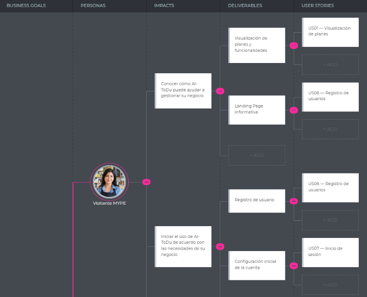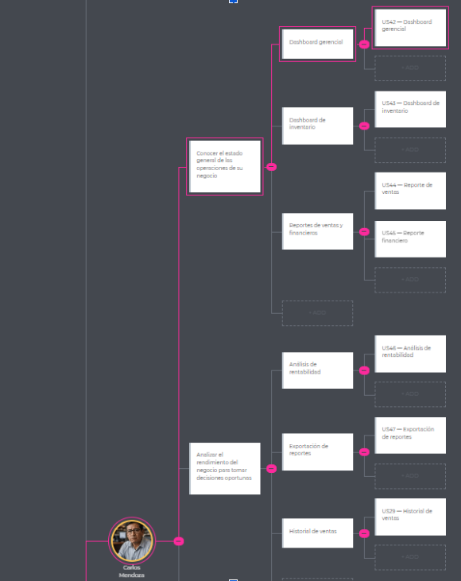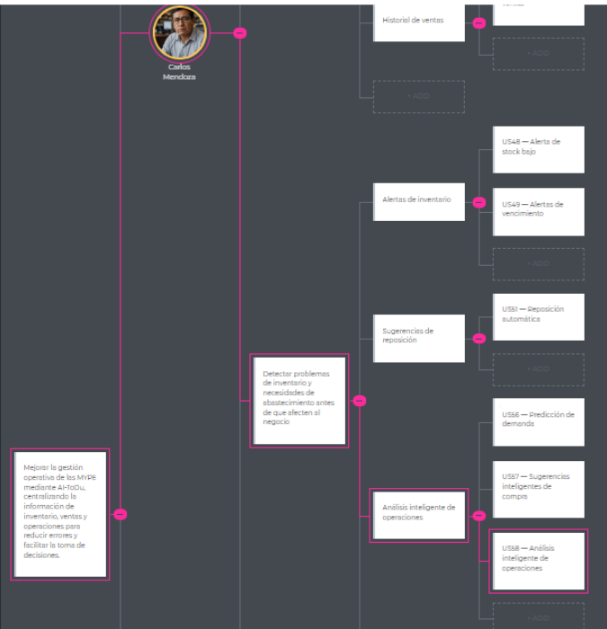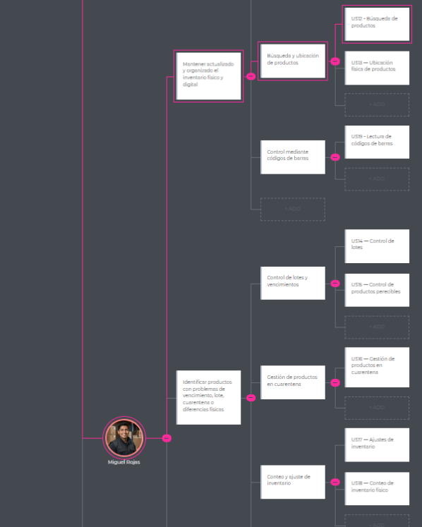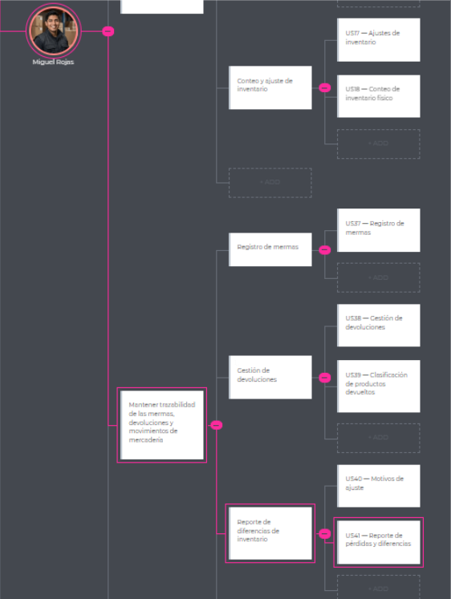*

&nbsp;

## 

## 

## 

## 

## **3.3. Product Backlog.**

Una vez definidas y estimadas las historias de usuario, las hemos priorizado en nuestro Product Backlog. Siguiendo las directrices de Scrum, el orden de priorización no se basa en la arquitectura técnica (ej. crear bases de datos o login primero), sino en el **valor para el negocio**.

Por ello, los User Stories relacionados al Landing Page (que nos permite captar clientes desde el día 1\) y el Módulo Core de Inventario (que resuelve el dolor principal de nuestro segmento) se encuentran en la cima del Backlog. Las estimaciones se realizaron utilizando *Planning Poker* con la secuencia de Fibonacci (1, 2, 3, 5, 8).

&nbsp;

Tabla de Estimación y Priorización:

&nbsp;

| \# Orden | User Story Id | Título | Descripción | Story Points |
| ----- | ----- | ----- | ----- | ----- |
| 1 | US01 | Visualización de planes | **Como** visitante de una MYPE, **quiero** visualizar los planes disponibles de AI-ToDu, **para** conocer las opciones y funcionalidades antes de registrarme. | 2 |
| 2 | US02 | Registro de mercancía | **Como** encargado de almacén, **quiero** registrar mercancías y productos en el sistema, **para** mantener un inventario digital actualizado. | 3 |
| 3 | US03 | Creación de venta | **Como** vendedor, **quiero** registrar una venta, **para** procesar las operaciones comerciales de manera rápida y ordenada. | 5 |
| 4 | US04 | Consulta de stock mediante API | **Como** sistema externo, **quiero** consultar el stock disponible mediante una API, **para** obtener información actualizada del inventario. | 5 |
| 5 | US05 | Configuración de roles | **Como** administrador, **quiero** configurar los roles de los usuarios, **para** controlar las funciones a las que puede acceder cada persona. | 3 |
| 6 | US06 | Registro de usuarios | **Como** usuario de una MYPE, **quiero** registrarme en AI-ToDu, **para** crear una cuenta y comenzar a utilizar la plataforma. | 3 |
| 7 | US07 | Inicio de sesión | **Como** usuario registrado, **quiero** iniciar sesión, **para** acceder de forma segura a las funcionalidades de AI-ToDu. | 2 |
| 8 | US08 | Recuperación de acceso | **Como** usuario, **quiero** recuperar mi acceso cuando olvide mis credenciales, **para** volver a utilizar mi cuenta. | 3 |
| 9 | US09 | Gestión de permisos | **Como** administrador, **quiero** asignar y modificar permisos, **para** controlar las acciones que cada usuario puede realizar. | 5 |
| 10 | US10 | Auditoría de acciones | **Como** administrador, **quiero** consultar las acciones realizadas por los usuarios, **para** mantener trazabilidad sobre las operaciones del sistema. | 5 |
| 11 | US11 | Actualización de stock | **Como** jefe de almacén/operario, **quiero** actualizar las existencias de los productos, **para** mantener sincronizado el inventario físico con el sistema. | 5 |
| 12 | US12 | Búsqueda de productos | **Como** jefe de almacén/operario, **quiero** buscar productos rápidamente, **para** localizar información de mercadería sin perder tiempo. | 3 |
| 13 | US13 | Ubicación física de productos | **Como** jefe de almacén/operario, **quiero** registrar la ubicación física de los productos, **para** encontrar fácilmente la mercadería dentro del almacén. | 5 |
| 14 | US14 | Control de lotes | **Como** jefe de almacén/operario, **quiero** gestionar los lotes de productos, **para** mantener la trazabilidad de la mercadería. | 5 |
| 15 | US15 | Control de productos perecibles | **Como** jefe de almacén/operario, **quiero** registrar fechas de vencimiento, **para** controlar los productos perecibles y evitar pérdidas. | 5 |
| 16 | US16 | Gestión de productos en cuarentena | **Como** jefe de almacén/operario, **quiero** marcar productos en cuarentena, **para** evitar que mercadería no apta sea utilizada o vendida. | 3 |
| 17 | US17 | Ajustes de inventario | **Como** jefe de almacén/operario, **quiero** realizar ajustes de inventario, **para** corregir diferencias justificadas entre el stock físico y el registrado. | 5 |
| 18 | US18 | Conteo de inventario físico | **Como** jefe de almacén/operario, **quiero** registrar conteos físicos de productos, **para** comparar las existencias reales con las del sistema. | 5 |
| 19 | US19 | Lectura de códigos de barras | **Como** jefe de almacén/operario, **quiero** escanear códigos de barras, **para** identificar productos y agilizar las operaciones de inventario. | 5 |
| 20 | US20 | Registro de proveedores | **Como** encargado de compras, **quiero** registrar proveedores, **para** mantener organizada la información necesaria para el abastecimiento. | 3 |
| 21 | US21 | Generación de órdenes de compra | **Como** encargado de compras, **quiero** generar órdenes de compra, **para** solicitar mercadería a los proveedores de manera formal y organizada. | 5 |
| 22 | US22 | Aprobación de compras | **Como** administrador, **quiero** aprobar órdenes de compra, **para** controlar las adquisiciones realizadas por la empresa. | 5 |
| 23 | US23 | Recepción de mercadería | **Como** jefe de almacén/operario, **quiero** registrar la recepción de mercadería, **para** actualizar el inventario con los productos recibidos. | 5 |
| 24 | US24 | Inspección de mercadería | **Como** jefe de almacén/operario, **quiero** inspeccionar la mercadería recibida, **para** verificar que los productos cumplan con las condiciones esperadas. | 5 |
| 25 | US25 | Gestión de clientes | **Como** vendedor, **quiero** registrar y administrar clientes, **para** asociarlos correctamente con las operaciones comerciales. | 3 |
| 26 | US26 | Carrito de ventas | **Como** vendedor, **quiero** agregar productos a un carrito de venta, **para** preparar y registrar una operación comercial. | 5 |
| 27 | US27 | Procesamiento de pagos | **Como** vendedor, **quiero** registrar y procesar pagos, **para** completar correctamente las transacciones comerciales. | 5 |
| 28 | US28 | Generación de comprobantes | **Como** vendedor, **quiero** generar comprobantes de venta, **para** entregar al cliente la constancia correspondiente de su compra. | 5 |
| 29 | US29 | Historial de ventas | **Como** administrador o vendedor, **quiero** consultar el historial de ventas, **para** revisar las operaciones comerciales realizadas. | 3 |
| 30 | US30 | Sincronización venta-inventario | **Como** administrador, **quiero** que las ventas actualicen automáticamente el inventario, **para** mantener las existencias sincronizadas con las operaciones comerciales. | 8 |
| 31 | US31 | Creación de manifiestos de despacho | **Como** encargado de despacho, **quiero** crear manifiestos de despacho, **para** organizar los pedidos que serán enviados. | 5 |
| 32 | US32 | Asignación de mercadería | **Como** encargado de despacho, **quiero** asignar la mercadería a cada envío, **para** asegurar que los productos correctos sean preparados para cada pedido. | 5 |
| 33 | US33 | Selección de rutas | **Como** encargado de despacho, **quiero** seleccionar rutas para los envíos, **para** organizar la distribución de los pedidos. | 5 |
| 34 | US34 | Confirmación de despacho | **Como** encargado de despacho, **quiero** confirmar la salida de un envío, **para** mantener actualizado el estado de los pedidos despachados. | 3 |
| 35 | US35 | Seguimiento de envíos | **Como** administrador, **quiero** consultar el estado de los envíos, **para** conocer el progreso de las entregas. | 5 |
| 36 | US36 | Registro de telemetría | **Como** sistema de AI-ToDu, **quiero** registrar datos de telemetría de los envíos, **para** disponer de información sobre su seguimiento y operación. | 8 |
| 37 | US37 | Registro de mermas | **Como** jefe de almacén/operario, **quiero** registrar las mermas de productos, **para** mantener trazabilidad de las pérdidas de inventario. | 3 |
| 38 | US38 | Gestión de devoluciones | **Como** encargado de almacén, **quiero** registrar y gestionar devoluciones, **para** controlar correctamente la mercadería que retorna al negocio. | 5 |
| 39 | US39 | Clasificación de productos devueltos | **Como** jefe de almacén/operario, **quiero** clasificar los productos devueltos según su estado, **para** determinar qué tratamiento debe recibir cada producto. | 3 |
| 40 | US40 | Motivos de ajuste | **Como** administrador, **quiero** registrar el motivo de cada ajuste de inventario, **para** mantener trazabilidad sobre las modificaciones realizadas. | 3 |
| 41 | US41 | Reporte de pérdidas y diferencias | **Como** administrador, **quiero** consultar reportes de pérdidas y diferencias de inventario, **para** identificar y analizar las variaciones existentes. | 5 |
| 42 | US42 | Dashboard gerencial | **Como** dueño de negocio, **quiero** visualizar un dashboard gerencial, **para** conocer el estado general de las operaciones de mi empresa. | 8 |
| 43 | US43 | Dashboard de inventario | **Como** administrador, **quiero** visualizar indicadores del inventario, **para** conocer el estado y comportamiento de las existencias. | 5 |
| 44 | US44 | Reporte de ventas | **Como** dueño de negocio, **quiero** generar reportes de ventas, **para** analizar el comportamiento de las operaciones comerciales. | 5 |
| 45 | US45 | Reporte financiero | **Como** dueño de negocio, **quiero** consultar información financiera, **para** conocer la situación económica del negocio. | 8 |
| 46 | US46 | Análisis de rentabilidad | **Como** dueño de negocio, **quiero** analizar la rentabilidad de las operaciones, **para** identificar el rendimiento económico del negocio. | 8 |
| 47 | US47 | Exportación de reportes | **Como** administrador, **quiero** exportar los reportes generados, **para** utilizarlos fuera de AI-ToDu o compartirlos con otras personas. | 3 |
| 48 | US48 | Alerta de stock bajo | **Como** administrador, **quiero** recibir alertas cuando el stock alcance niveles bajos, **para** anticiparme a posibles quiebres de inventario. | 3 |
| 49 | US49 | Alertas de vencimiento | **Como** jefe de almacén/operario, **quiero** recibir alertas sobre productos próximos a vencer, **para** tomar acciones antes de que se generen pérdidas. | 3 |
| 50 | US50 | Centro de notificaciones | **Como** usuario, **quiero** consultar mis notificaciones en un solo lugar, **para** conocer oportunamente los eventos importantes del sistema. | 3 |
| 51 | US51 | Reposición automática | **Como** administrador, **quiero** generar sugerencias o acciones automáticas de reposición, **para** mantener niveles adecuados de inventario. | 8 |
| 52 | US52 | Automatización de procesos | **Como** administrador, **quiero** automatizar tareas operativas repetitivas, **para** reducir el trabajo manual y los errores. | 8 |
| 53 | US53 | Integración con servicios externos | **Como** administrador, **quiero** integrar AI-ToDu con servicios externos, **para** intercambiar información con otros sistemas utilizados por la empresa. | 8 |
| 54 | US54 | Integración con telemetría IoT | **Como** administrador, **quiero** integrar dispositivos IoT con AI-ToDu, **para** recibir información de los dispositivos utilizados en las operaciones. | 8 |
| 55 | US55 | Detección de anomalías de inventario | **Como** administrador, **quiero** detectar automáticamente anomalías en el inventario, **para** identificar comportamientos o diferencias que requieran revisión. | 8 |
| 56 | US56 | Predicción de demanda | **Como** dueño de negocio, **quiero** obtener predicciones de demanda, **para** anticipar las necesidades futuras de inventario. | 8 |
| 57 | US57 | Sugerencias inteligentes de compra | **Como** encargado de compras, **quiero** recibir sugerencias inteligentes de compra, **para** apoyar la planificación del abastecimiento. | 8 |
| 58 | US58 | Análisis inteligente de operaciones | **Como** dueño de negocio, **quiero** obtener análisis inteligentes de las operaciones, **para** identificar información relevante para la gestión del negocio. | 8 |
| 59 | US59 | Registro de suscripción | **Como** propietario de una MYPE, **quiero** registrar una suscripción, **para** comenzar a utilizar AI-ToDu bajo un plan determinado. | 3 |
| 60 | US60 | Gestión de planes | **Como** administrador de AI-ToDu, **quiero** gestionar los planes disponibles, **para** ofrecer diferentes opciones de servicio a las MYPE. | 5 |
| 61 | US61 | Límites del plan | **Como** administrador de AI-ToDu, **quiero** configurar límites según el plan contratado, **para** controlar las funcionalidades y recursos disponibles para cada cliente. | 5 |
| 62 | US62 | Administración de suscripciones | **Como** administrador de AI-ToDu, **quiero** administrar las suscripciones de los clientes, **para** controlar el estado de sus servicios contratados. | 5 |
| 63 | US63 | API de inventario | **Como** desarrollador o sistema externo, **quiero** acceder a una API de inventario, **para** consultar e intercambiar información de productos y existencias. | 5 |
| 64 | US64 | API de transacciones comerciales | **Como** desarrollador o sistema externo, **quiero** acceder a una API de transacciones comerciales, **para** integrar operaciones de ventas con otros sistemas. | 8 |
| 65 | US65 | Autenticación de API | **Como** administrador o desarrollador, **quiero** autenticar las solicitudes realizadas a las APIs, **para** proteger el acceso a la información y operaciones del sistema. | 5 |
| 66 | US66 | Manejo de errores estandarizados | **Como** desarrollador, **quiero** disponer de respuestas de error estandarizadas, **para** facilitar la integración y el manejo de errores en los servicios. | 3 |
| 67 | US67 | Logs y monitoreo | **Como** administrador de la plataforma, **quiero** registrar y monitorear los eventos del sistema, **para** detectar problemas y supervisar el funcionamiento de AI-ToDu. | 5 |
| 68 | US68 | Backup y recuperación | **Como** administrador de la plataforma, **quiero** realizar respaldos y recuperar información, **para** proteger los datos ante fallos o pérdida de información. | 8 |

&nbsp;

# 

# **Capítulo IV: Product Design**

En este capítulo detallamos las directrices visuales, arquitectónicas y de experiencia de usuario que guiarán el desarrollo de AI-ToDu. El diseño de nuestro producto se fundamenta en heurísticas de usabilidad estandarizadas, garantizando una curva de aprendizaje mínima y una alta eficiencia operativa para las MYPES.

## **4.1. Style Guidelines.**

Para mantener la consistencia visual y técnica en todo el ecosistema (Landing Page y Web Application), hemos definido un *Design System* centralizado, tomando como base principal los principios de **Material Design** (integrado técnicamente vía Angular Material).

### **4.1.1. General Style Guidelines.**

Nuestras decisiones de diseño a nivel general se sustentan en la heurística de "Consistencia y estándares", asegurando que los usuarios no tengan que preguntarse si diferentes palabras, situaciones o acciones significan lo mismo.

* **Brand & Tono de Comunicación:** Al ser una herramienta B2B que maneja datos logísticos y financieros, nuestra comunicación se rige por las siguientes cuatro dimensiones:
  * **Serio (no divertido):** Nos enfocamos en la productividad y en resolver problemas de negocio sin distracciones innecesarias.
  * **Formal (no casual):** Transmitimos profesionalismo y seguridad, vital para ganarnos la confianza de dueños y gerentes.
  * **Respetuoso (no irreverente):** Valoramos el tiempo y el esfuerzo de nuestros usuarios operativos.
  * **Sereno (no entusiasta):** Mantenemos una interfaz limpia que no abrume al usuario, especialmente durante tareas estresantes como el cuadre de inventario.
* **Typography:** Hemos seleccionado la familia tipográfica **Inter** para los encabezados y **Roboto** para las tablas de datos e interfaz general. Estas fuentes sans-serif ofrecen una legibilidad altísima en pantallas de cualquier tamaño y densidad de píxeles, reduciendo la carga cognitiva.
* Colors:
  * *Primary (Corporate Navy \- \#0F172A):* Un azul oscuro que denota estabilidad, seguridad de la información y profesionalismo corporativo.
  * *Accent (Teal \- \#0D9488):* Un verde azulado vibrante utilizado estrictamente para *Call-to-Actions* (CTAs) y botones principales.
  * *Semantic Colors:* Rojo (\#DC2626) para alertas de quiebre de stock, Ambar (\#F59E0B) para revisiones pendientes, y Verde (\#16A34A) para confirmaciones de éxito (basado en la heurística de "Visibilidad del estado del sistema").

### **4.1.2. Web Style Guidelines.**

Para las interfaces web responsivas, adoptaremos un sistema de grillas fluidas de 12 columnas.

* **Componentes:** Uso intensivo de tarjetas (*Cards*) para agrupar información lógicamente y *Data Tables* con paginación para manejar altos volúmenes de registros.
* **Interacción:** Todos los elementos interactivos (botones, enlaces) tendrán un estado *hover* y *focus* claramente definido, cumpliendo con las heurísticas de prevención de errores y accesibilidad.

## **4.2. Information Architecture.**

La arquitectura de información de AI-ToDu está diseñada para que visitantes y usuarios operativos encuentren lo que necesitan con el menor número de clics posible, reduciendo la fricción.

### **4.2.1. Organization Systems.**

Aplicaremos diferentes esquemas de organización dependiendo de la vista y la intención del usuario:

* **Organización Jerárquica:** Utilizada en el menú de navegación lateral (*Sidenav*). Los módulos de alto nivel (Inventario, Ventas, Facturación) se despliegan para revelar submódulos (Ingresos, Salidas, Reportes).
* **Organización Matricial:** Aplicada en los módulos del núcleo operativo (ej. *WarehouseModule*), donde los usuarios podrán organizar las tablas de inventario cruzando variables como SKU, fecha de ingreso y estado de conservación.
* **Organización Secuencial:** Empleada en flujos de trabajo críticos, como el *Shipment Manifest* (Manifiesto de Despacho), guiando al operario paso a paso (Selección de ruta \-\> Asignación de mercadería \-\> Confirmación) para prevenir errores.

### **4.2.2. Labeling Systems.**

Para asegurar la claridad, nuestras etiquetas reflejan fielmente el **Ubiquitous Language** del dominio logístico, evitando jergas técnicas de software.

* En lugar de usar "Crear un nuevo ítem", usaremos la etiqueta **"Registrar Entrada"**.
* En lugar de "Módulo de envíos", usaremos **"Despacho y Trazabilidad"**.
* Los botones de confirmación tendrán etiquetas descriptivas sobre la acción exacta (ej. **"Aprobar Manifiesto"** en lugar del genérico "Aceptar").

### **4.2.3. SEO Tags and Meta Tags**

Para el Landing Page (optimización de adquisición de clientes) y la Web Application, configuraremos los siguientes metadatos en el encabezado HTML:

\<\!-- Landing Page SEO Tags \--\>

\<title\>AI-ToDu | Software de Gestión de Inventario y Ventas para MYPES\</title\>

\<meta name="description" content="AI-ToDu es la plataforma SaaS B2B que centraliza la logística, inventario y facturación de tu negocio. Diseñado para MYPES, restaurantes y distribuidoras."\>

\<meta name="keywords" content="software inventario MYPE, ERP para pequeñas empresas, control de almacén, facturación electrónica, logística B2B Perú"\>

\<meta name="author" content="IA-INNOVATION"\>

\<\!-- Web Application App Tags \--\>

\<title\>Dashboard | AI-ToDu App\</title\>

\<meta name="robots" content="noindex, nofollow"\> \<\!-- Evita que los motores de búsqueda indexen datos privados del SaaS \--\>

### **4.2.4. Searching Systems.**

Dada la cantidad de mercadería que maneja una MYPE, el sistema de búsqueda es fundamental:

* **Búsqueda Global (Global Search):** Ubicada en el *Top App Bar*, permitirá a los usuarios buscar un producto rápidamente escaneando el código de barras (SKU) o escribiendo su nombre.
* **Búsqueda Facetada (Filtros):** En las tablas de datos, los usuarios podrán aplicar filtros simultáneos combinados (ej. Mostrar solo "Productos Perecibles" con "Stock Mínimo").
* **Presentación de resultados:** Los resultados se mostrarán en tiempo real (búsqueda reactiva) resaltando el término coincidente. En caso de no encontrar resultados, se mostrará un mensaje claro ("No se encontraron artículos con ese SKU") y un botón para sugerir la creación del producto.

### **4.2.5. Navigation Systems.**

El recorrido del usuario estará soportado por elementos de navegación predecibles:

* **Top App Bar (Landing Page):** Navegación horizontal anclada (*sticky*) que contiene anclas hacia las secciones de "Propuesta de Valor", "Precios" y un *Call to Action* persistente para "Iniciar Sesión" o "Prueba Gratuita".
* **Side Navigation Drawer (Web Application):** El menú lateral izquierdo será el sistema principal de navegación dentro de la plataforma, colapsable para dejar más espacio útil en pantalla al manejar tablas de inventario.
* **Breadcrumbs (Migas de pan):** Para procesos profundos (ej. Almacén \> Ingresos \> Lote \#1042), permitiendo al usuario saber exactamente dónde está y retroceder con un solo clic.

## **4.3. Landing Page UI Design.**

En esta sección presentamos el diseño de interfaz de usuario para el Landing Page de AI-ToDu. La propuesta visual traduce nuestras decisiones de Arquitectura de Información y Guías de Estilo en una interfaz orientada a la conversión B2B. El diseño se enfoca en transmitir confianza institucional y guiar al visitante (dueños de negocios) hacia el registro o prueba del sistema, asegurando una experiencia inclusiva y adaptable a cualquier dispositivo móvil o de escritorio.

### **4.3.1. Landing Page Wireframe.**

Nuestros wireframes para Desktop y Mobile Web Browser establecen la jerarquía visual de la página sin distracciones estéticas. Hemos priorizado la heurística de "Diseño estético y minimalista", asegurando que el *Hero Section* contenga una propuesta de valor clara y un único *Call to Action* (CTA) prominente. La estructura modular permite apilar fácilmente el contenido en la vista móvil.

 Wireframe Landing Page Desktop

 Wireframe Landing Page Mobile

### **4.3.2. Landing Page Mock-up.**

Partiendo de los wireframes, los mock-ups integran nuestro *Design System*. Utilizamos la paleta de colores corporativa (Navy y Teal) para resaltar los botones de acción sobre fondos limpios, cumpliendo con los estándares de contraste (WCAG) para un diseño inclusivo. La tipografía *Inter* proporciona un aspecto moderno y altamente legible.

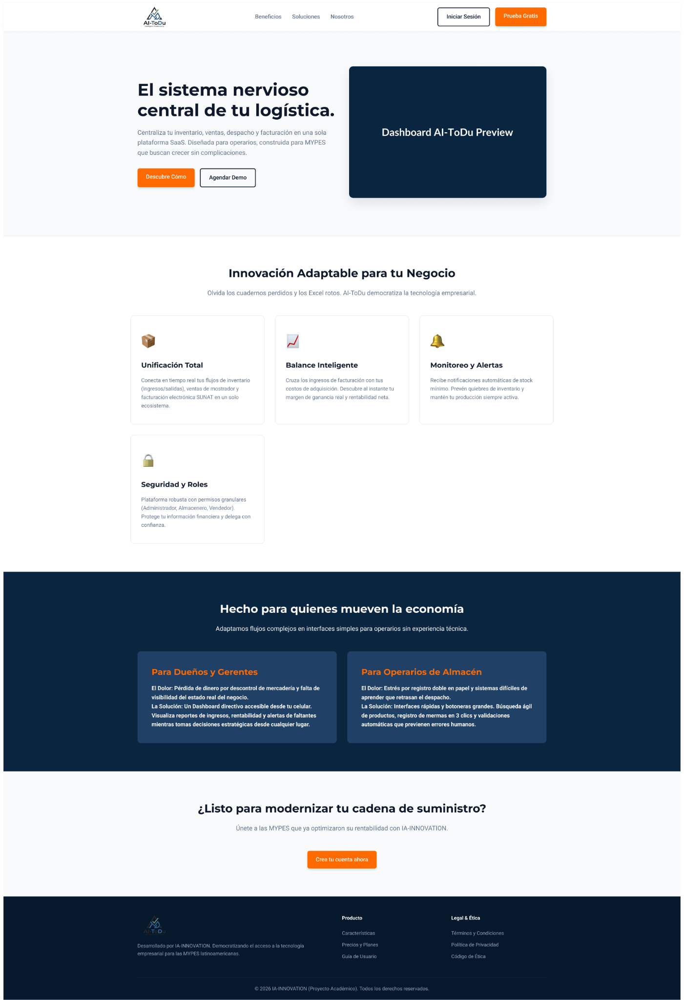 MockUp Landing Page Desktop

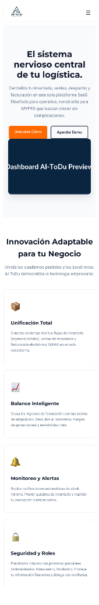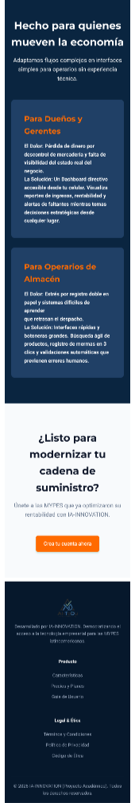MockUp Landing Page Mobile

Link de Figma: [AI-ToDu | Figma Apps Web](https://www.figma.com/design/tPmzGrVXLTbnfOCBikVKwB/AI-ToDu-%7C-Figma-Apps-Web?node-id=0-1&t=tuGwtparpfqb4gNj-1)

## **4.4. Web Applications UX/UI Design.**

El diseño de la aplicación web (el software SaaS en sí) está construido bajo una estricta modularidad utilizando como referencia los patrones de **Angular Material**. El enfoque principal es la eficiencia del usuario operativo (almaceneros y dueños), minimizando la carga de memoria (reconocer en lugar de recordar) y previniendo errores en el ingreso de datos logísticos.

### **4.4.1. Web Applications Wireframes.**

Los wireframes de la aplicación definen la disposición del espacio de trabajo. Se ha implementado un Sidenav colapsable en la izquierda para la navegación principal y una amplia área central para las Data Tables (tablas de datos) de inventario. Esta disposición maximiza el espacio útil en pantalla, vital para revisar largos listados de SKUs.

\[Insertar imagen: Wireframes de las principales vistas de la Web App \- Dashboard e Inventario\]

### **4.4.2. Web Applications Wireflow Diagrams.**

Para mapear los flujos de tareas transversales, elaboramos un Wireflow extendido que cubre desde el primer contacto del usuario con la plataforma hasta la acción core del negocio. El objetivo (*User goal*) de este flujo es: **Ingresar o registrarse en AI-ToDu, llegar al Dashboard, y registrar un ingreso de mercadería al almacén.**

El diagrama ilustra paso a paso cómo la vista cambia en respuesta a la interacción del usuario, guiando el proceso lógicamente desde la autenticación hasta la actualización del estado del sistema:

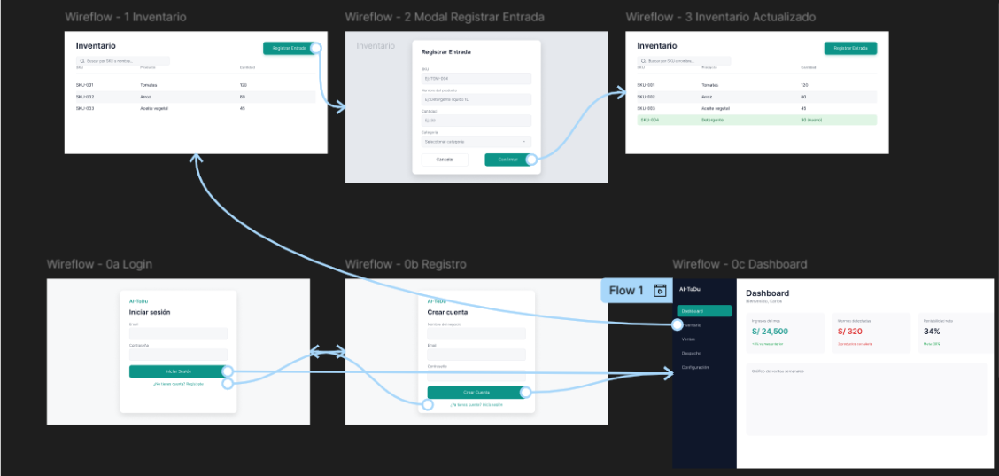

**Explicación del flujo:**

1. **Login / Registro:** El visitante llega a la pantalla de autenticación. Si ya tiene cuenta, ingresa sus credenciales y hace clic en "Iniciar Sesión"; si es nuevo, completa el formulario de registro (nombre del negocio, email y contraseña) y hace clic en "Crear Cuenta". Ambos caminos son intercambiables mediante los enlaces cruzados ("¿No tienes cuenta?" / "¿Ya tienes cuenta?"), cumpliendo con la heurística de libertad y control del usuario.
2. **Dashboard:** Tras autenticarse, el sistema lo dirige al Dashboard gerencial, que muestra de inmediato los indicadores clave del negocio (ingresos, mermas detectadas y rentabilidad neta), cumpliendo con la heurística de visibilidad del estado del sistema desde el primer momento.
3. **Navegación a Inventario:** Desde el Sidenav, el usuario hace clic en "Inventario" para acceder al módulo operativo donde se gestionan los productos.
4. **Registrar Entrada (Modal):** En la tabla de inventario, el usuario hace clic en "Registrar Entrada", lo que despliega un modal (*Dialog*) con el formulario de ingreso (SKU, nombre del producto, cantidad y categoría), sin sacarlo de contexto de la tabla principal.
5. **Confirmación y actualización:** Al completar el formulario y hacer clic en "Confirmar", la tabla principal se actualiza mostrando el nuevo registro resaltado, cumpliendo con la visibilidad del estado del sistema y confirmando al usuario que la acción se ejecutó correctamente.

### **4.4.3. Web Applications Mock-ups.**

Los mock-ups de la plataforma SaaS aplican rigurosamente nuestra guía de estilos. Las alertas y estados de inventario utilizan *Semantic Colors* (rojo para quiebres de stock, verde para transacciones exitosas). Los componentes de Angular Material (como *Cards*, *Mat-Tables* y *Mat-Buttons*) brindan un aspecto limpio y profesional, reduciendo el estrés cognitivo durante jornadas laborales largas.

\[Insertar imagen: Mock-ups en alta fidelidad de la Web App (Dashboard, Tablas y Formularios)\]

### **4.4.4. Web Applications User Flow Diagrams.**

A diferencia del wireflow, este User Flow Diagram detalla los caminos alternativos y la validación de errores. El objetivo (*User goal*) abordado es: **Procesar un Manifiesto de Despacho logístico**.

\[Insertar imagen: User Flow Diagram con happy paths y unhappy paths\] *Explicación de flujos y condiciones:* El *happy path* muestra una asignación exitosa de ruta y confirmación de despacho. Sin embargo, el *unhappy path* detalla qué ocurre si el sistema detecta que el usuario no tiene los roles necesarios o si un campo obligatorio del formulario está vacío (mostrando alertas preventivas claras en pantalla en lugar de fallar silenciosamente).

## **4.5. Web Applications Prototyping.**

Nuestro prototipo navegable consolida las decisiones de Arquitectura de Información e interacciones. Hemos configurado estados reactivos (*hover* en botones, selección de filas en tablas) para brindar retroalimentación inmediata al operario. La navegación es predecible, utilizando *breadcrumbs* (migas de pan) para asegurar que el usuario pueda retroceder de una tarea profunda (ej. Detalles de Lote) sin usar el botón de retroceso del navegador, evitando pérdidas de información no guardada.

\[Insertar imagen: Captura de pantalla representativa del Prototipo interactivo en Figma\] *Enlace al video demostrativo de los flujos de interacción:* \[URL de Microsoft Stream del video de simulación\]

## **4.6. Domain-Driven Software Architecture.**

A partir del entendimiento general del negocio logrado en el *Big Picture Event Storming*, hemos profundizado en la arquitectura del software aplicando *Domain-Driven Design* (DDD). En esta sección presentamos la transición de los eventos de negocio hacia artefactos de software concretos (Comandos, Agregados y Modelos de Lectura) y su representación estructural utilizando el Modelo C4, lo que nos permite visualizar la solución desde un nivel de abstracción alto (Contexto) hasta el nivel técnico (Componentes).

### **4.6.1. Design-Level Event Storming.**

Para esta fase, el equipo llevó a cabo una sesión de *Design-Level Event Storming* con el objetivo de refinar los eventos descubiertos previamente y agruparlos lógicamente. Durante este proceso, identificamos los *Commands* (acciones del usuario, representadas en notas azules) que disparan los eventos, los *Aggregates* (entidades de dominio, en notas amarillas) que validan las reglas de negocio, y las *Queries/Read Models* (notas verdes) que los usuarios necesitan ver en pantalla.

Como resultado de la organización, definimos cuatro *Bounded Contexts* (Contextos Delimitados) principales para la plataforma SaaS:

1. **Identity and Access Management (IAM):** Gestiona la autenticación, autorización y perfiles de los empleados de la MYPE.
2. **Warehouse and Inventory Management:** El *Core Domain*, encargado del control de stock, movimientos y métricas de almacenamiento.
3. **Logistics and Dispatch:** Gestiona las salidas de mercadería, manifiestos de ruta y trazabilidad.
4. **Billing and Transactions:** Administra las ventas, pagos y emisión de comprobantes.

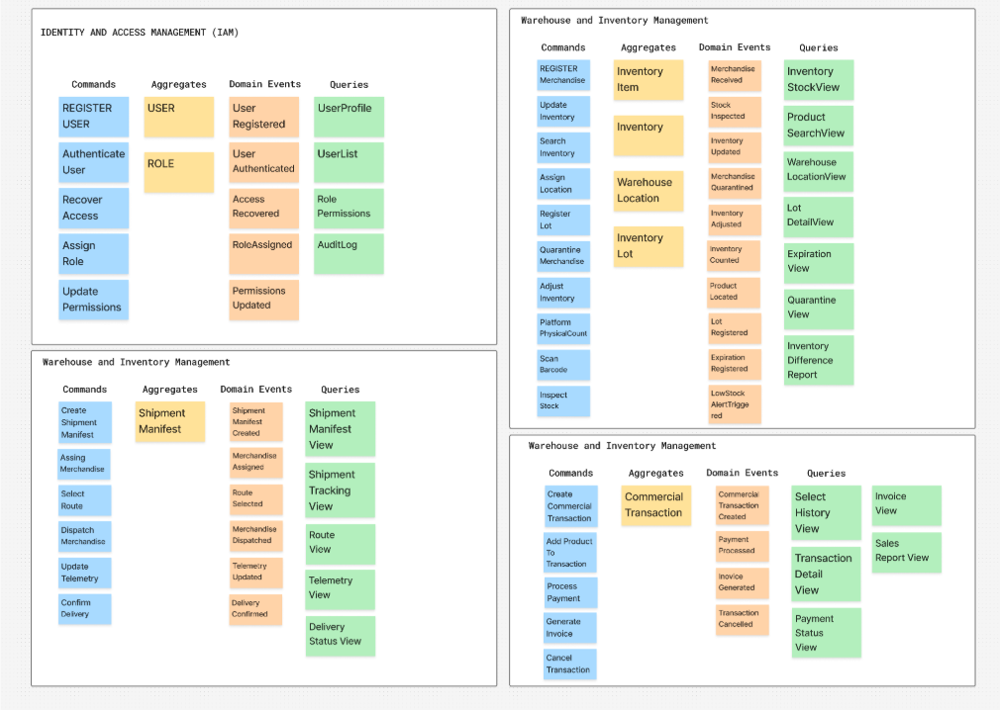

### **4.6.2. Software Architecture Context Diagram.**

El Diagrama de Contexto (Nivel 1 del Modelo C4) ilustra a AI-ToDu en el centro de su entorno operativo, mostrando las interacciones de alto nivel con los actores del sistema y los sistemas externos (terceros) obligatorios para la operación.

Explicación del diagrama:

* **Usuarios (Actors):** Identificamos al *Business Owner* (quien consume reportes y métricas) y al *Warehouse Operator* (quien ingresa datos de inventario y despachos).
* **Sistema Central:** "AI-ToDu SaaS", que centraliza la operación.
* **Sistemas Externos:** Para brindar una solución completa en Perú, el sistema se integra con la **SUNAT API** (para la validación y emisión de comprobantes de pago electrónicos obligatorios) y con un servicio de **Email Gateway** (ej. SendGrid o AWS SES) para el envío de alertas de stock mínimo a los dueños.

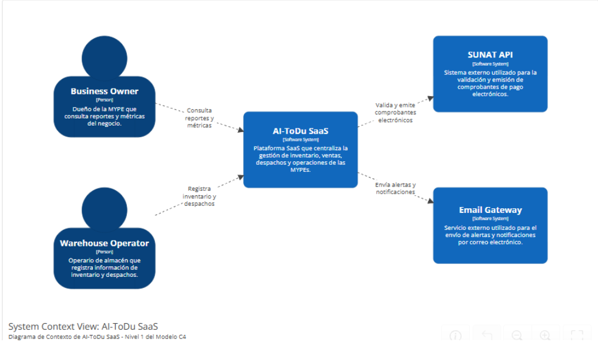

### **4.6.3. Software Architecture Container Diagrams.**

El Diagrama de Contenedores (Nivel 2 del Modelo C4) descompone el sistema central en unidades de despliegue independientes, reflejando nuestras decisiones tecnológicas y de infraestructura.

Explicación del diagrama:

* **Landing Page (Static Web Site):** Desarrollado en HTML5, CSS3 y JavaScript, alojado de forma independiente (ej. GitHub Pages o Vercel) para la captación de clientes.
* **Web Application (Single-Page Application):** Desarrollada con el framework Angular y TypeScript. Se comunica con el backend exclusivamente mediante llamadas HTTP asíncronas.
* **RESTful API (Backend Application):** Desarrollada en C\# utilizando el framework Spring Boot. Este contenedor expone los *Endpoints* consumidos por la aplicación frontend y orquesta la lógica de negocio de los *Bounded Contexts*.
* **Database (Relational RDBMS):** Base de datos principal (ej. PostgreSQL o MySQL) que persiste el estado de los *Aggregates*.

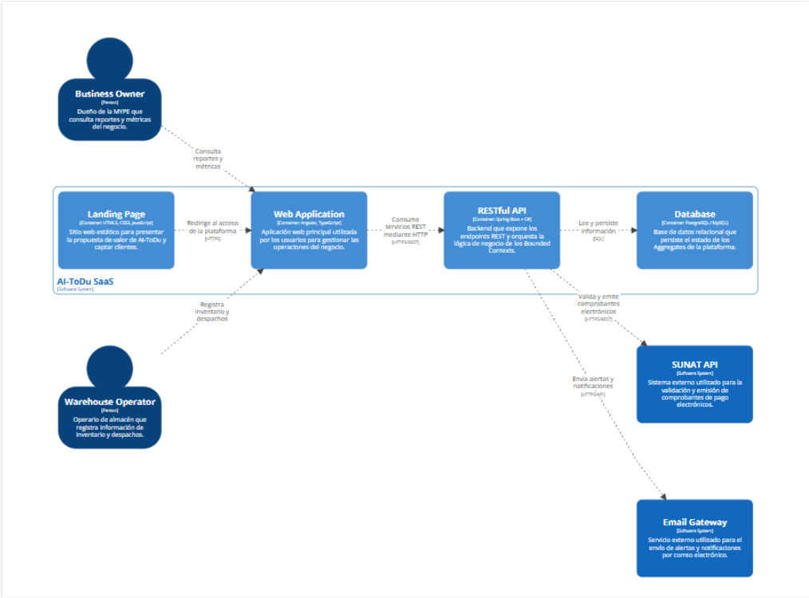

### **4.6.4. Software Architecture Components Diagrams.**

El Diagrama de Componentes (Nivel 3 del Modelo C4) hace "zoom" dentro del contenedor del **RESTful API** para detallar sus bloques estructurales internos y la aplicación del diseño modular.

*Explicación del diagrama:* Cada *Bounded Context* se implementa como un módulo dentro de Spring Boot. Por ejemplo, el módulo de Inventario (*Warehouse*) muestra cómo las solicitudes HTTP entrantes son recibidas por el InventoryController, delegadas al InventoryService (donde reside la lógica de negocio) y finalmente cómo el InventoryRepository interactúa con la base de datos a través de Spring Data JPA. También se visualiza el componente SecurityFilter encargado de validar los tokens de acceso de cada petición (IAM).

(Insertar imagen: Diagrama de Componentes (Nivel 3\) mostrando Controladores, Servicios y Repositorios en Spring Boot )

* sku, dimensionalWeight) tienen modificadores de acceso private para evitar 4.7. Software Object-Oriented Design.

En esta sección detallamos cómo los conceptos teóricos descubiertos en el Event Storming y estructurados en nuestra arquitectura (DDD) se traducen en artefactos de código concretos mediante el Diseño Orientado a Objetos (POO). El objetivo principal de nuestro diseño es proteger los "Invariantes" (reglas de negocio) encapsulando el estado de los objetos y exponiendo únicamente comportamientos (métodos) con significado para el dominio.

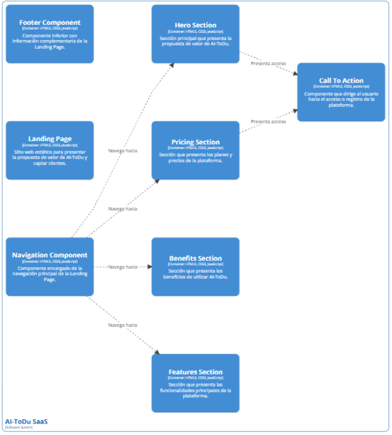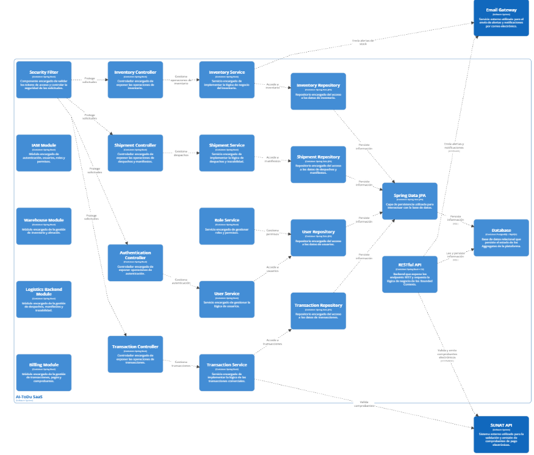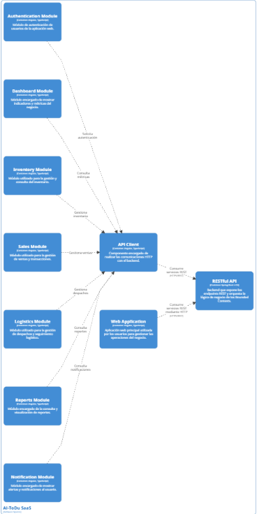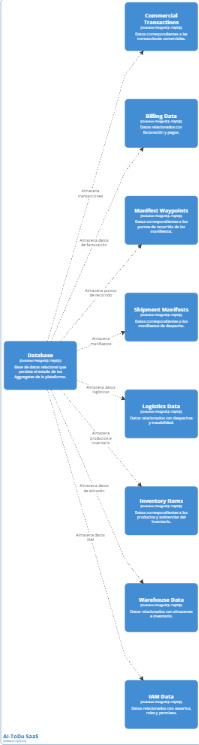 4.7.1. Class Diagrams.

A continuación, presentamos los Diagramas de Clases UML para los Bounded Contexts principales de nuestro backend en Spring Boot (Java), mapeando las interfaces definidas en nuestro frontend (TypeScript) hacia clases de dominio robustas.

* Warehouse Context (Gestión de Inventario):
  * La clase InventoryItem actúa como el Aggregate Root. Sus atributos (ej. modificaciones externas directas.
  * En lugar de simples "setters", la clase expone métodos de dominio como updateConservationStatus(ConservationStatus newStatus) que validan las reglas de negocio antes de mutar el estado.
  * Utiliza la enumeración ConservationStatus.
* **Logistics Context (Despacho y Trazabilidad):**
  * La clase ShipmentManifest es el **Aggregate Root**.
  * Contiene a IoTTelemetry como un **Value Object** (Objeto de Valor). En POO, esto significa que IoTTelemetry es una clase inmutable (solo lectura tras su creación) y carece de un ID propio, ya que su identidad depende totalmente del ShipmentManifest al que pertenece.
  * Expone métodos como addWaypoint(String waypoint) y dispatchFleet().
* **Billing Context (Facturación):**
  * La clase CommercialTransaction es el **Aggregate Root**.
  * Para mantener el desacoplamiento estricto que exige DDD, esta clase almacena una referencia lógica (linkedManifestId de tipo String/UUID) en lugar de tener una relación de objeto directa con ShipmentManifest. Esto permite que el módulo de Facturación evolucione independientemente del de Logística.
  * Expone métodos como calculateTaxes() que encapsulan la lógica impositiva.

&nbsp;

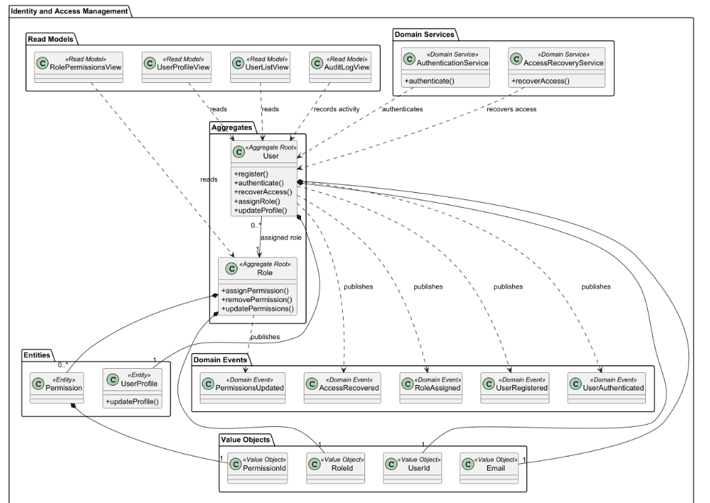

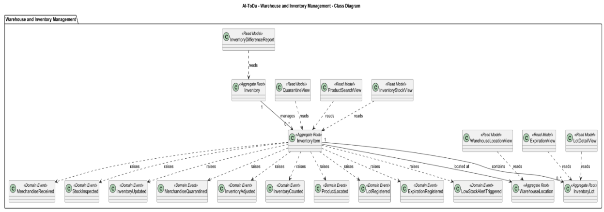

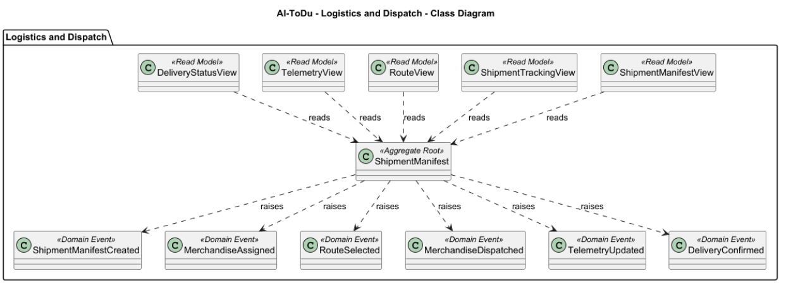

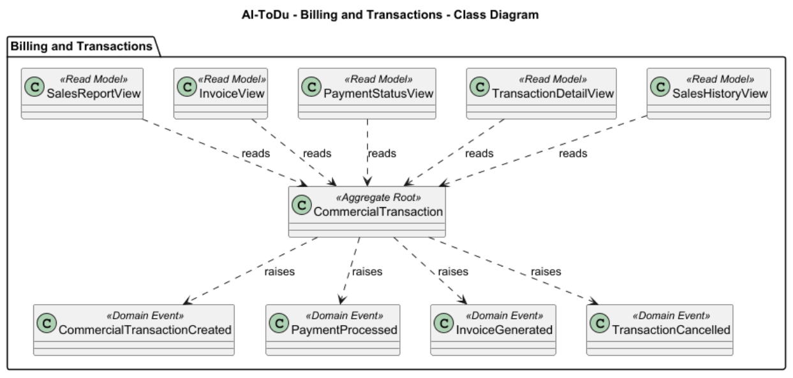

## **4.8. Database Design.**

El diseño de nuestra base de datos relacional (SQL Server) sigue la misma filosofía de separación por *Bounded Contexts*. Para evitar el acoplamiento a nivel de base de datos (el antipatrón "Big Ball of Mud"), cada contexto delimitado es dueño de sus propias tablas, y las referencias cruzadas se manejan de forma blanda (mediante identificadores alfanuméricos) en lugar de *Foreign Keys* estrictas a nivel de motor de base de datos.

### **4.8.1. Database Diagrams.**

Hemos utilizado Spring Data JPA para el mapeo objeto-relacional (ORM), lo que se refleja en nuestros Diagramas de Base de Datos (ERD):

* **Esquema WAREHOUSE:**
  * Tabla inventory\_items: La llave primaria (id) es un UUID. Los estados del Enum (conservation\_status) se persisten como cadenas de texto (VARCHAR) para mayor legibilidad y mantenibilidad.
* **Esquema LOGISTICS:**
  * Tabla shipment\_manifests: Almacena la data central del despacho.
  * Debido a que IoTTelemetry es un *Value Object*, no tiene su propia tabla. En su lugar, hemos aplicado el patrón @Embedded de JPA, por lo que sus atributos (latitude, longitude, temperature\_celsius) se "aplanan" y se guardan como columnas directamente dentro de la tabla shipment\_manifests.
  * Tabla manifest\_waypoints (1:N): Tabla dependiente para almacenar la lista de strings de las rutas.
* **Esquema BILLING:**
  * Tabla commercial\_transactions: Almacena el subtotal, impuestos y total de la venta.
  * Incluye la columna linked\_manifest\_id (VARCHAR), la cual actúa como una referencia lógica al despacho, respetando la autonomía del esquema de ventas sin generar bloqueos en cascada en la base de datos.

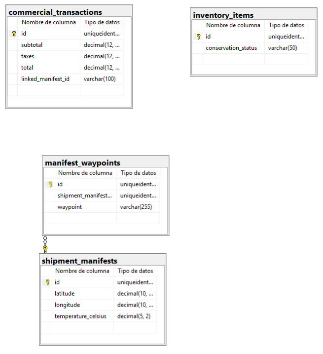

&nbsp;